# Apna Slot

Apna Slot is a booking app for sports venues. Venue owners list their turfs, courts and halls.
Customers pick a time slot, pay, and get a confirmed booking. Two people can never book the same
slot.

It is a [Frappe](https://frappeframework.com) app with a Vue 3 frontend built on
[frappe-ui](https://github.com/frappe/frappe-ui).

> **Status:** early build. The first full path through the app works: sign up, list a venue,
> book a slot, pay with a test gateway, and see the booking. Price rules, teams, cancellations
> and emails are planned but not built yet. See [specs/PROGRESS.md](specs/PROGRESS.md).

## Table of Contents

- [Features](#features)
- [How it works](#how-it-works)
- [Screenshots](#screenshots)
  - [For customers](#for-customers)
  - [For venue owners](#for-venue-owners)
- [Installation](#installation)
- [Development](#development)
- [Testing](#testing)
- [Project layout](#project-layout)
- [Main ideas in the code](#main-ideas-in-the-code)
- [Roadmap](#roadmap)
- [Contributing](#contributing)
- [CI](#ci)
- [License](#license)

## Features

What works today:

- **Accounts.** Sign up and log in from the app.
- **Businesses.** Any user can create one business (called a *publisher*) to list venues under.
- **Venues.** Create a venue with its first bookable resource (for example "Turf A"), set opening
  hours, slot length and price. Then publish or unlist it.
- **Browse.** Anyone can see published venues and the open slots for a day.
- **Hold a slot.** Picking a slot holds it for 10 minutes while the customer pays.
- **Test payments.** A mock payment gateway lets you choose Succeed, Fail or Abandon. No real
  money moves.
- **My bookings.** Customers see all their bookings and the status of each.
- **Auto release.** A background job runs every 2 minutes and frees holds that were never paid.
- **No double booking.** A unique database index makes sure one slot can only be sold once, even
  when two people click at the same moment.
- **Separate tenants.** Each business only sees its own venues, slots and payments.

## How it works

1. A venue owner signs up and creates a business.
2. They add a venue and its first resource, then publish it.
3. A customer opens the venue, picks a date and a slot.
4. The slot is held for 10 minutes. The booking is **Pending Payment**.
5. The customer pays on the mock gateway:
   - **Succeed:** the booking becomes **Confirmed**.
   - **Fail:** the booking becomes **Payment Failed** and the slot is free again.
   - **Abandon:** nothing changes until the hold runs out. Then the job marks it **Expired** and
     frees the slot.

## Screenshots

The app lives at `/apnaslot` on your site. All screenshots are in
[docs/screenshots](docs/screenshots).

### For customers

**Home page.** Lists every published venue with its city and starting price.

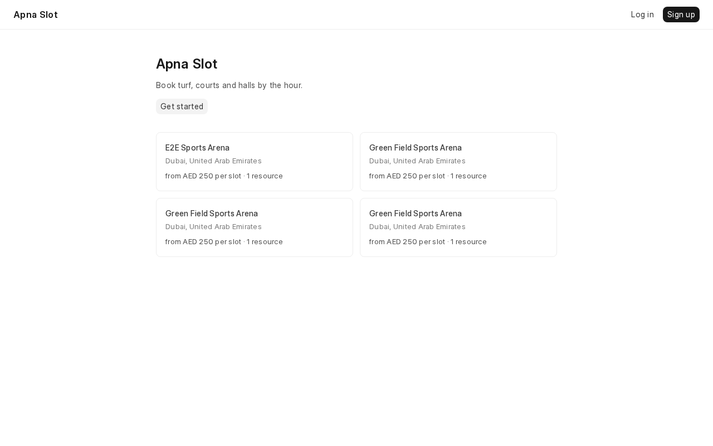

**Sign up and log in.**

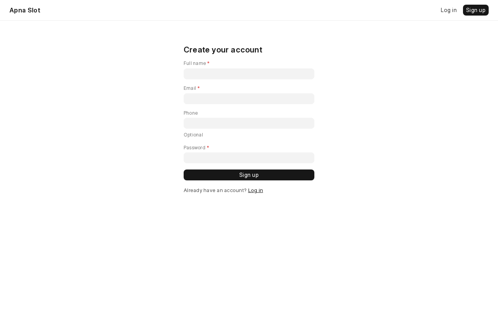

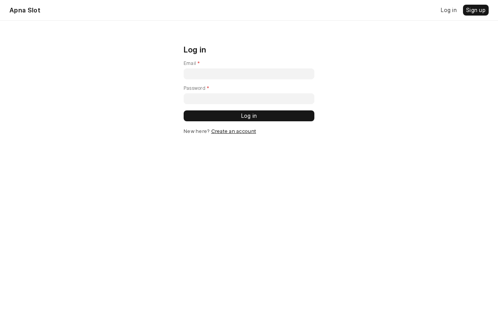

**Venue page.** Pick a date to see the slots for that day. Each slot shows its price, or
"Booked" if someone already has it.

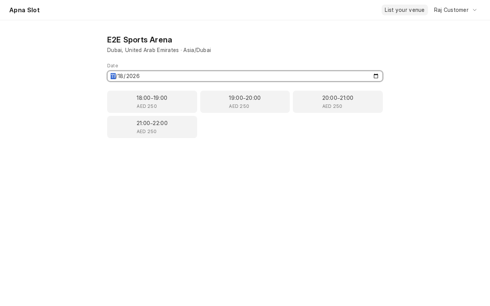

**Your hold.** After picking a slot you get 10 minutes to pay. The countdown shows how much time
is left.

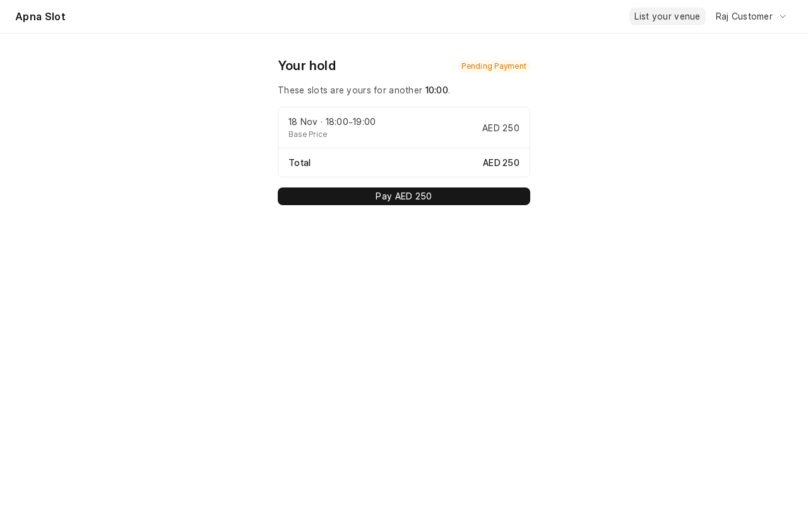

**Mock payment gateway.** A test page that stands in for a real payment provider.

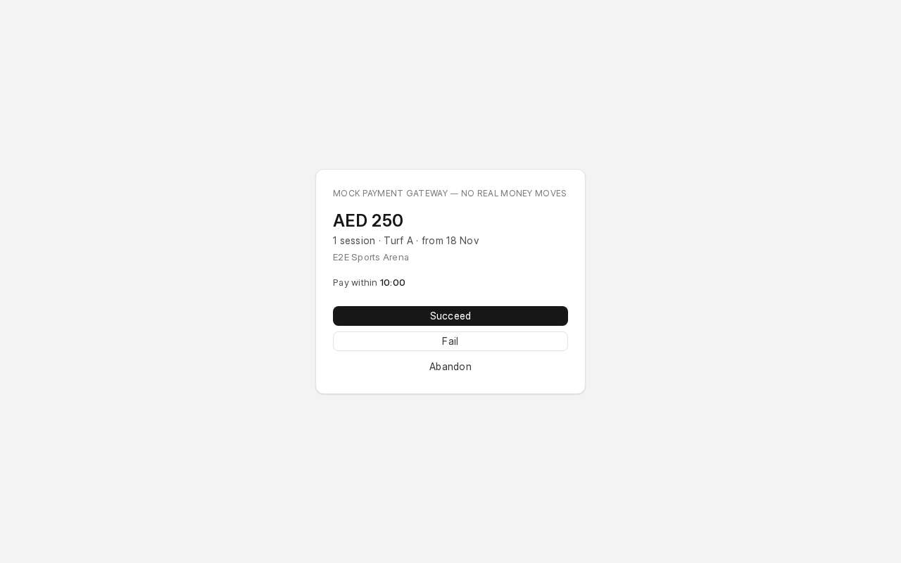

**Confirmed booking.**

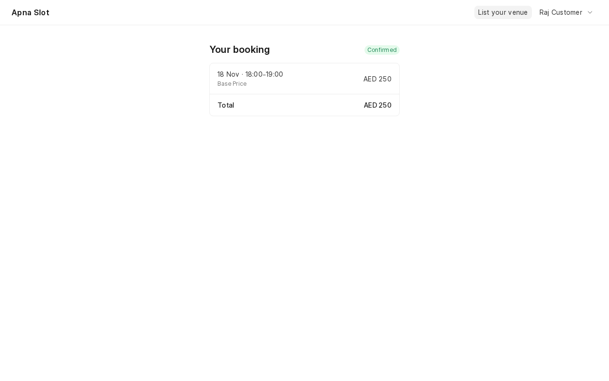

**My bookings.** Every booking with its date, time, price and status.

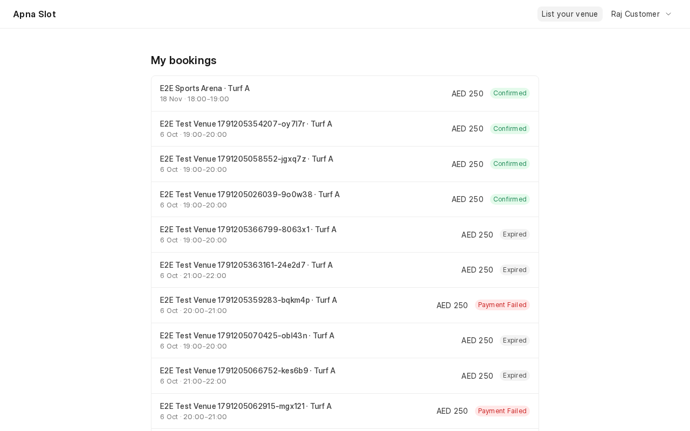

### For venue owners

**Create a business.** Shown when a user clicks "List your venue" for the first time.

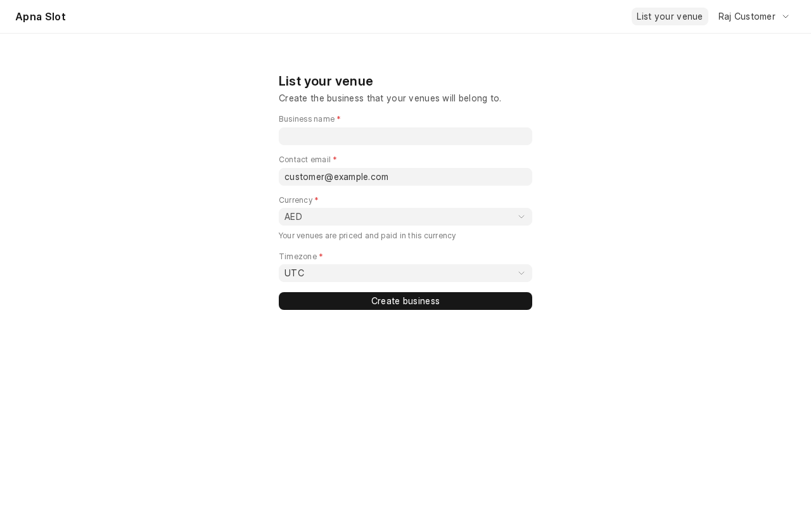

**Venues.** All venues of your business. Publish a venue to make it bookable, or unlist it to
hide it.

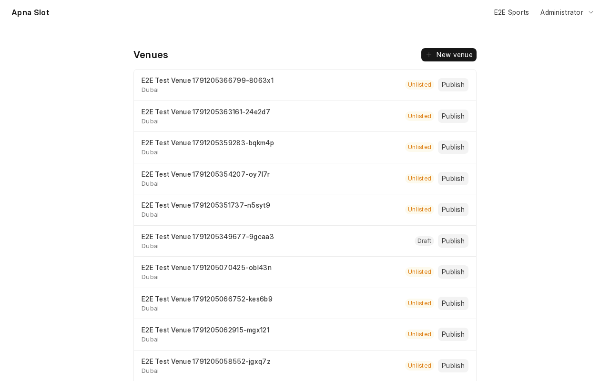

**New venue.** Add the venue details and its first resource. Opening hours apply to every day
and must split into whole slots.

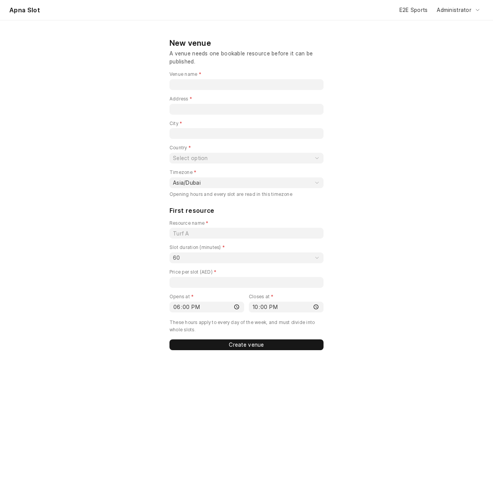

## Installation

You need a working [bench](https://github.com/frappe/bench) with Frappe v16.

```bash
cd $PATH_TO_YOUR_BENCH
bench get-app $URL_OF_THIS_REPO --branch main
bench --site your-site.localhost install-app apna_slot
bench --site your-site.localhost migrate
```

Open `http://your-site.localhost:8000/apnaslot` in your browser.

To have some data to look at, load the test seed. It creates a business called "E2E Sports",
one published venue, and a customer login (`customer@example.com` / `admin`):

```bash
bench --site your-site.localhost execute apna_slot.e2e_seed.setup_e2e_data
```

## Development

The backend is the Frappe app in `apna_slot/`. The frontend is a Vue 3 single page app in
`frontend/`, served at `/apnaslot`.

```bash
npm install      # installs Playwright and the frontend packages
npm run dev      # Vite dev server
npm run build    # builds to apna_slot/public/frontend/ and writes apna_slot/www/apnaslot.html
```

If your bench's `default_site` is a different site, serve this one on its own port:

```bash
bench --site apnaslot.localhost serve --port 8001
```

The design notes, decisions and build plan are in [specs/](specs/README.md). Start there before
making big changes.

## Testing

**Python tests** cover the booking engine, payments, permissions and the expiry job:

```bash
bench --site apnaslot.localhost run-tests --app apna_slot
```

**End to end tests** use [Playwright](https://playwright.dev). The specs are in `e2e/tests/`.
Load the seed once per site, then run the suite:

```bash
bench --site apnaslot.localhost execute apna_slot.e2e_seed.setup_e2e_data
npm run test:e2e
```

When the site runs on port 8001, point the suite at it:

```bash
BASE_URL=http://apnaslot.localhost:8001 SITE_HOST=apnaslot.localhost:8001 \
  API_BASE=http://127.0.0.1:8001 FRAPPE_PASSWORD=frappeadmin npm run test:e2e
```

Other useful scripts:

| Command | What it does |
|---|---|
| `npm run test:e2e:ui` | Opens the Playwright UI |
| `npm run test:e2e:headed` | Runs the tests in a visible browser |
| `npm run test:e2e:debug` | Runs the tests step by step |

More detail is in [specs/03-testing.md](specs/03-testing.md).

## Project layout

```
apna_slot/
  api/                  Whitelisted endpoints: auth, discovery, availability, booking, payment, publisher
  apna_slot_core/       DocTypes: Publisher, Publisher Member, Venue, Bookable Resource, Resource Schedule Row
  apna_slot_booking/    DocTypes: Booking, Booking Line, Booking Slot, Payment Transaction
  gateways/             Payment gateway interface and the mock gateway
  availability.py       Works out which slots are open on a day
  booking_engine.py     Creates, confirms and releases bookings
  pricing.py            Works out the price of a slot
  permissions.py        Keeps each business's data separate
  jobs.py               Scheduled job that expires unpaid holds
  e2e_seed.py           Test data for the Playwright suite
frontend/src/
  pages/                Customer pages
  pages/manage/         Venue owner pages
e2e/                    Playwright specs and helpers
specs/                  Design docs, decisions and progress
```

## Main ideas in the code

- **Booking Slot ledger.** Every booked slot is one row in `Booking Slot` with a unique index on
  resource, date and start time. If two bookings race for the same slot, the database lets only
  one through.
- **Local time first.** Venue hours and slots are stored in the venue's own timezone. A UTC copy
  is saved next to it for sorting and jobs.
- **One hold length.** `HOLD_MINUTES` in `apna_slot/constants.py` sets the hold time. The UI
  countdown, the expiry job and the tests all read it.
- **Swappable gateway.** Payments go through a gateway interface in `apna_slot/gateways/`. The
  mock gateway signs its callbacks, so a forged or repeated callback is refused.

## Roadmap

Planned phases, in order. Details are in [specs/](specs/README.md).

| Phase | What it adds |
|---|---|
| 0 | Activity types, amenities, team members and roles |
| 1 | Full venue listing, closures, weekly schedule builder |
| 2 | Price rules and a pricing calendar |
| 3 | Many slots in one booking, many dates, weekly series |
| 4 | Commission and safer payment handling |
| 5 | Search, better slot picker, owner calendar |
| 6 | Cancellations, refunds, emails and reminders |

## Contributing

This app uses `pre-commit` for formatting and linting. [Install pre-commit](https://pre-commit.com/#installation)
and turn it on for this repo:

```bash
cd apps/apna_slot
pre-commit install
```

It runs these tools:

- ruff
- eslint
- prettier
- pyupgrade

Commits follow [Conventional Commits](https://www.conventionalcommits.org).

## CI

GitHub Actions runs these workflows:

- **CI:** installs the app and runs the Python tests on every push to `main` and every pull
  request.
- **UI Tests:** installs the app on `apnaslot.test`, loads the seed, and runs the Playwright suite
  on every push to `main` and every pull request.
- **Linters:** runs [Frappe Semgrep Rules](https://github.com/frappe/semgrep-rules) and
  [pip-audit](https://pypi.org/project/pip-audit/) on every pull request.

## License

AGPL-3.0
