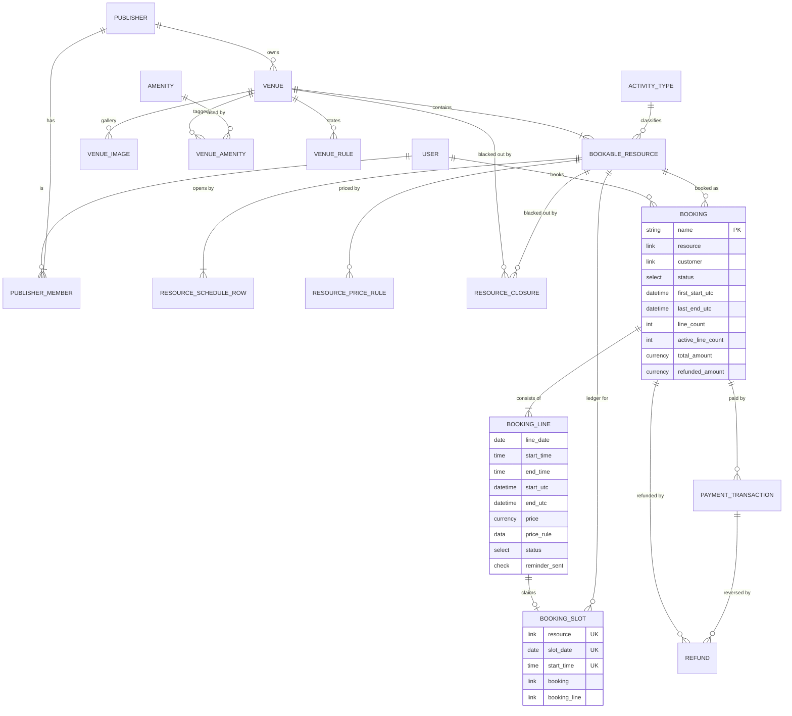
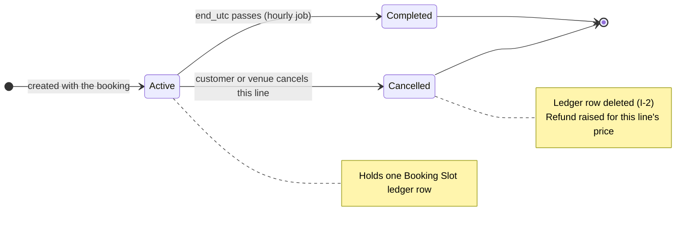
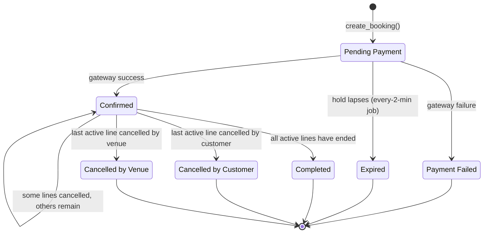

# Domain Model

The vocabulary, the entities, and the invariants. Every phase document builds on this file.

## Glossary

| Term | Meaning |
|---|---|
| **Publisher** | A business that lists venues. The tenant boundary. Has one or more member users. |
| **Venue** | A physical location owned by a Publisher. "Green Field Sports Arena". Carries address, photos, rules, amenities, timezone, currency and booking policy. Not itself bookable. |
| **Bookable Resource** | The thing that actually gets booked. "Turf A (5-a-side)". Belongs to one Venue. Carries opening hours, slot length, and pricing. |
| **Slot** | One fixed-length window on a Bookable Resource, e.g. `2026-09-12 19:00–20:00`. Derived, never stored as an empty record. |
| **Booking** | A customer's reservation of one or more slots on **one resource**, across **one or many dates**, paid for together. |
| **Booking Line** | One slot inside a booking, carrying its own date, times, price and lifecycle. A 6-week Saturday series is one Booking with six lines. |
| **Booking Slot** | One ledger row per line. The unique index on these rows is the double-booking guarantee. |
| **Series** | A set of lines generated by the "repeat weekly" helper. A UI convenience — **no recurrence rule is ever stored** (D-30). |
| **Hold** | The 10-minute window during which a `Pending Payment` booking blocks **all** its lines' slots while the customer is in the gateway. |
| **Activity Type** | What a resource is for: football turf, cricket net, badminton court, banquet hall… A seeded taxonomy. |
| **Closure** | A publisher-declared blackout on a venue or a resource for a date range, whole-day or time-bounded. |
| **Price Rule** | A conditional price on a resource, matched by day-of-week, time band and/or date range, resolved by priority. |

## Entity relationships



`BOOKING_LINE ||--o| BOOKING_SLOT` is one-to-zero-or-one deliberately: an active line owns exactly
one ledger row, a cancelled line owns none (I-2).

## DocType inventory

Ordered by the phase that introduces them.

`Created` is the phase where the DocType first exists; `Completed` is where its field set is
finished. The eight created in Phase T ship at a minimum field set and are extended later
(see [phase-t-tracer.md](./phase-t-tracer.md) §3). Modules per D-33.

| DocType | Type | Module | Created | Completed | Naming |
|---|---|---|---|---|---|
| Publisher | Document | Core | **T** | 0 | `PUB-.#####` |
| Publisher Member | Child | Core | **T** | 0 | — |
| Activity Type | Document | Core | 0 | 0 | `field:activity_name` |
| Amenity | Document | Core | 0 | 0 | `field:amenity_name` |
| Venue | Document | Core | **T** | 1 | `VEN-.#####` |
| Venue Image | Child | Core | 1 | 1 | — |
| Venue Amenity | Child (Table MultiSelect) | Core | 1 | 1 | — |
| Venue Rule | Child | Core | 1 | 1 | — |
| Bookable Resource | Document | Core | **T** | 2 | `RES-.#####` |
| Resource Schedule Row | Child | Core | **T** | T | — |
| Resource Closure | Document | Core | 1 | 1 | `CLS-.#####` |
| Resource Price Rule | Child | Core | 2 | 2 | — |
| Booking | Document | Booking | **T** | 6 | `BKG-.YYYY.-.#####` |
| **Booking Line** | **Child** | Booking | **T** | 6 | — |
| Booking Slot | Document | Booking | **T** | **T** | `hash` |
| Payment Transaction | Document | Booking | **T** | 4 | `PAY-.YYYY.-.#####` |
| Refund | Document | Booking | 6 | 6 | `REF-.YYYY.-.#####` |
| Refund Line | Child | Booking | 6 | 6 | — |

`Booking Slot` is the one DocType that ships complete in Phase T, because it *is* invariant I-1.

No DocType is submittable. Immutability is enforced in controllers (see Invariant I-7).

## The shape of a booking

One booking covers **one resource** and **one or more slots**, which may be non-adjacent and may
sit on different dates (D-28). The resource is single so that `publisher`, `venue`, `currency`,
`timezone` and the cancellation policy can be snapshotted onto the booking exactly once.

```
Booking BKG-2026-00001   resource: Turf A   status: Confirmed   total: AED 750
├─ Line 1  Sat 12 Sep  19:00–20:00  AED 250  Active
├─ Line 2  Sat 19 Sep  19:00–20:00  AED 250  Active
└─ Line 3  Sat 26 Sep  19:00–20:00  AED 250  Cancelled  → Refund REF-2026-00004 (AED 250)
```

Caps live on the resource: `max_slots_per_booking` (per date, default 4) and
`max_dates_per_booking` (default 8). Anything longer is a season pass, which is Phase 7.

## Time and timezone model

The most easily broken part of this system. Three rules, no exceptions.

1. **Local wall-clock is the source of truth.** Each `Booking Line` stores `line_date` (Date),
   `start_time` (Time) and `end_time` (Time) in the **venue's** timezone. Publishers define
   schedules in wall-clock ("we open at 06:00") and customers read grids in wall-clock. These are
   the fields the UI renders. Nothing converts them for display.

2. **UTC is denormalised per line.** On insert, each line's `start_utc` / `end_utc` are computed
   via `ZoneInfo(venue.timezone)` localisation → `astimezone(UTC)`, and the parent's
   `first_start_utc` / `last_end_utc` are rolled up from the active lines. The line-level UTC
   fields are what the reminder and completion jobs query — a single ordered axis across every
   venue in every timezone. They are written once and never recomputed: if a venue's timezone is
   edited later, existing bookings keep the instants they were made with (I-9).

3. **DST is documented, not solved.** When a venue's local date has a DST transition, the
   availability generator skips slots whose local time does not exist that day, and for an
   ambiguous (repeated) local hour it takes the **first** occurrence (`fold=0`). Stated here so
   nobody "fixes" it into a duplicate-booking bug.

Timezone values are IANA identifiers (`Asia/Kolkata`, `Asia/Dubai`), validated server-side against
`zoneinfo.available_timezones()`.

### Midnight crossing

A schedule row must satisfy `opens_at < closes_at`, with the single exception that
`closes_at = 00:00:00` means **end of day (24:00)**. A venue open 18:00–02:00 expresses this as two
rows on two different days (Fri 18:00–00:00 and Sat 00:00–02:00). This keeps every slot
unambiguously owned by exactly one calendar date, which is what makes `(resource, slot_date,
start_time)` a valid unique key.

## Currency model

- Every Venue has a `currency`. Every money field downstream of that venue is in that currency,
  snapshotted onto the Booking at creation.
- There is **no conversion anywhere**. No exchange rates, no base currency, no FX feed.
- A booking covers one resource, hence one venue, hence one currency — which is precisely why the
  cross-venue cart was rejected (D-28).

## Booking Line state machine

The line is where the lifecycle actually happens. The parent's status is a roll-up of its lines.



## Booking state machine



The self-transition on `Confirmed` is the important one: cancelling three of six lines leaves the
booking `Confirmed` with `active_line_count = 3`. The booking only reaches a cancelled status when
its **last** active line goes, and it takes the flavour of whoever cancelled that last line.

| Status | Lines hold slots? | Terminal? |
|---|---|---|
| Pending Payment | yes (all) | no |
| Confirmed | yes (active lines only) | no |
| Completed | yes (past slots stay claimed) | yes |
| Payment Failed | no | yes |
| Expired | no | yes |
| Cancelled by Customer | no | yes |
| Cancelled by Venue | no | yes |

Transitions not drawn are illegal and must raise `frappe.ValidationError` in `Booking.validate`.

## System invariants

Testable properties. Each phase document names the tests that prove the ones it introduces.

- **I-1 — Exclusivity.** No two `Booking Slot` rows may share the same
  `(resource, slot_date, start_time)`. Enforced by a **database unique index**, not by application
  code. Two concurrent confirmations of the same slot: exactly one succeeds, the other fails
  cleanly with a retryable error.
- **I-2 — Ledger correspondence.** A `Booking Slot` row exists **if and only if** its
  `Booking Line` is `Active` or `Completed` and its booking is in a slot-holding status. Cancelled
  lines and expired/failed bookings **delete** their rows (MariaDB has no partial unique index), so
  the ledger is current-state only — history lives on the Booking and its lines.
- **I-3 — Booking shape.** All lines of a booking are on **one resource**. No two lines may share
  the same `(line_date, start_time)`. Per date, at most `max_slots_per_booking` lines; across the
  booking, at most `max_dates_per_booking` distinct dates. **Lines need not be adjacent and need
  not share a date** (D-28).
- **I-4 — Schedule containment.** Every line lies inside the resource's weekly schedule for its own
  weekday and outside every applicable closure, evaluated at creation time. Later schedule edits do
  not invalidate existing bookings.
- **I-5 — Booking window.** **Every** line's `start_utc` falls within
  `[now + min_lead_minutes, now + max_advance_days]` at creation. The furthest line governs — a
  6-week series is impossible at a venue with `max_advance_days = 30`, and the UI must say so
  rather than silently truncating the series.
- **I-6 — Price snapshot.** Each line records the price and the rule that produced it, resolved for
  **that line's own date** — so a Saturday line in a weekly series can cost more than the Wednesday
  one. `Booking.total_amount` equals the sum of **all** lines' prices at creation and never changes
  thereafter; money returned is tracked in `refunded_amount`, never by editing the total.
- **I-7 — Post-confirmation immutability.** Once `Confirmed`, the resource, currency, every line's
  date/times/price, and `total_amount` are read-only. Lines may only change `status`. Enforced in
  the controller, since no DocType is submittable.
- **I-8 — Tenant isolation.** A user may read or write a Publisher, Venue, Bookable Resource,
  Resource Closure, Booking, Payment Transaction or Refund only if they are a member of the owning
  Publisher — or, for bookings, the customer on it. Enforced by `permission_query_conditions`
  **and** `has_permission`, never by UI filtering alone.
- **I-9 — Snapshot immutability.** `Booking.timezone` and `Booking.currency` are copied from the
  venue at creation and never change, even if the venue's are later edited.
- **I-10 — Money reconciliation.** At all times
  `refunded_amount == sum(price of Cancelled lines)` and
  `net_amount == total_amount - refunded_amount`, and at confirmation
  `commission_amount + publisher_payout_amount == net_amount`.

## Roles

| Role | Granted to | Can |
|---|---|---|
| `Apna Slot Customer` | every user created through signup | create bookings, read published venues, manage own bookings |
| `Apna Slot Publisher` | a user who completes publisher onboarding | everything above, plus CRUD on their own Publisher's venues, resources, closures, prices; read/cancel bookings against their venues |
| `System Manager` | platform admin | everything; the only role that can edit Activity Type / Amenity taxonomies |

There is no separate admin role. Platform administration is Desk + `System Manager`.
