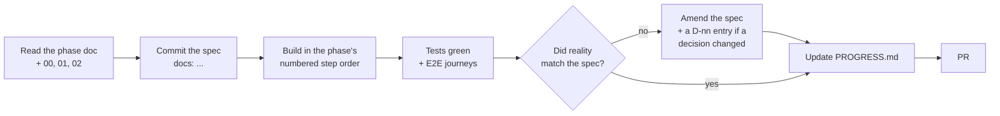

# Workflow

How a phase gets from spec to merged. Derived from [CLAUDE.md](../CLAUDE.md) → *Commit / PR* and
*Planning*.

---

## 1. The loop for one phase



**Commit the spec before you begin.** A spec edited after the code is a description, not a plan.
If the spec turns out to be wrong mid-build, stop, amend it in its own commit, and continue — the
diff between the two spec commits is the record of what the tracer bullet taught you.

---

## 2. Conventional commits

```
<type>(<scope>): <subject>
```

**Types:** `feat` · `fix` · `refactor` · `test` · `docs` · `chore` · `perf` · `style`

**Scopes** track the module layout in [02-conventions.md](./02-conventions.md):

`publisher` · `venue` · `resource` · `pricing` · `availability` · `booking` · `ledger` ·
`payment` · `refund` · `notifications` · `permissions` · `jobs` · `frontend` · `specs` · `bench`

Examples:

```
feat(ledger): add Booking Slot with unique index on resource+date+start
feat(booking): create bookings as one line per selected slot
fix(availability): derive weekday from venue-local date, not UTC
test(ledger): prove two concurrent bookings leave one row
docs(specs): reconcile phase 3 with the shipped line-level release API
```

Rules:
- Subject in the imperative, lower case, no trailing period, ≤ 72 characters.
- One logical change per commit. The unique-index patch and the doctype that needs it belong
  together; an unrelated rename does not.
- The body explains **why**, and cites the decision when one applies (`Implements D-28.`,
  `Proves I-1.`). CLAUDE.md puts change explanation in the commit message rather than in inline
  comments — this is where that lands.
- Never commit built frontend assets (`apna_slot/public/frontend/` is gitignored), screenshots, or
  `.pyc`.

Trailer on every commit:

```
Co-Authored-By: Claude Opus 5 <noreply@anthropic.com>
```

---

## 3. Branches

`phase/<n>-<slug>` — `phase/t-tracer`, `phase/3-booking-engine`. One branch per phase; the numbered
steps inside a phase are commits on it, each leaving the app runnable.

---

## 4. Pull requests

Title is the phase: `feat(booking): phase 3 — availability and booking engine`.

Body covers, briefly:

- **What ships** — one line per deliverable.
- **Invariants proved** — which of I-1…I-10, with the test that proves each.
- **Spec reconciliation** — what changed in the spec during the build and why, or "spec unchanged".
- **Verification** — the `run-tests` command and its result; the E2E journey ids that passed.
- **Deferred** — anything moved to a later phase, with the phase.

Do not open a PR until [03-testing.md](./03-testing.md) §5 *Definition of done* holds in full.

---

## 5. Spec reconciliation

After each phase, walk its document and fix anything the build changed:

- Field tables against the actual DocType JSON — fieldnames, types, `reqd`, defaults.
- API signatures against the actual whitelisted methods.
- Route list against `router.js`.
- Test table against the test module.
- If a **decision** changed, add or amend an entry in [01-decisions.md](./01-decisions.md) with the
  rejected alternative — never silently overwrite the old rationale. D-5's amendment by D-28 is the
  model: the original decision stays readable, with the amendment noted inline.
- If an **invariant** changed, [00-domain-model.md](./00-domain-model.md) is updated first and
  everything else follows it.

A phase document that no longer matches the code is worse than no document, because the next phase
is planned against it.

---

## 6. Running the site

```bash
bench start                                            # background only, and only if not already up
bench --site apnaslot.localhost migrate
bench --site apnaslot.localhost clear-cache
cd apps/apna_slot/frontend && yarn build
```

Site: `apnaslot.localhost:8000` · `Administrator` / `frappeadmin`.

Scheduler must be enabled for the expiry, completion and reminder jobs:

```bash
bench --site apnaslot.localhost enable-scheduler
bench --site apnaslot.localhost execute apna_slot.jobs.expire_pending_bookings   # manual trigger
```
