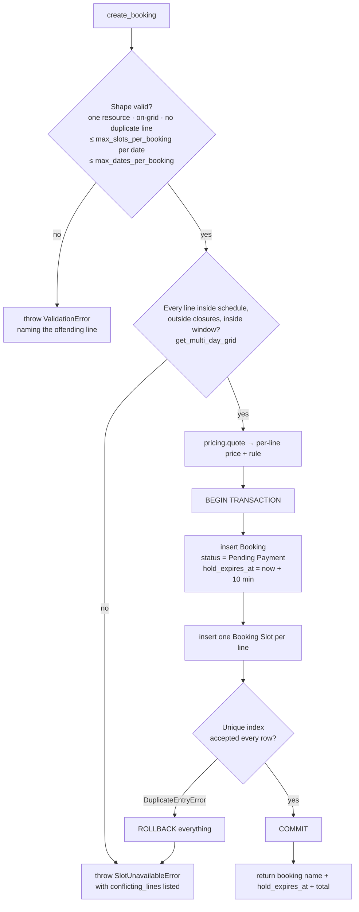

# Phase 3 — Availability & Booking Engine

**Goal:** the correctness core of the product. Availability is computed from schedule minus
closures minus ledger; a booking atomically claims **every slot it covers, across every date it
covers**; two people cannot hold the same slot; abandoned holds release themselves.

This phase is specified **before** payments (D-24) so the concurrency invariant reads independently
of gateway callbacks. In build order it comes after Phase T, which already ships both the ledger and
the callback — so there is no internal-confirm stage and no Phase 4 rewire. D-24's accepted cost is
therefore not paid.

> **Already delivered by [Phase T](./phase-t-tracer.md).** The `Booking Slot` ledger **and its
> unique-index patch**, `Booking` + `Booking Line` (one row per booking), `AvailabilityGrid` for a
> single date, single-slot `create_booking` with rollback, `confirm_booking`, `release_booking`,
> and the every-2-minute `expire_pending_bookings` job. **I-1 and I-2 are already proven** by
> `test_concurrent_booking_same_slot_one_wins` and `test_expiry_job_releases_hold`.
>
> **This phase adds:** closures, the DST skip/fold filter and the window statuses in the grid;
> `for_dates()` batching; multi-slot and multi-date bookings with all-or-nothing rollback and
> `conflicting_lines`; `expand_weekly_series` and `preview_series`; `release_line` and the
> roll-ups; the hourly `complete_past_lines` job; and the controller guards for I-3, I-5 and I-7.
>
> **Reconciliation note:** `api.booking.confirm_internal` in §7 below is **not built**. Phase T
> ships the payment callback in step T-e, so `Confirmed` is reachable through the real path from
> the first commit and the `System Manager` backdoor never needs to exist. Phase 4's
> `test_confirm_internal_removed` becomes an assertion that it was never added.

## In scope

Availability computation + API, `Booking` + `Booking Line`, the `Booking Slot` ledger with its
unique index, the hold, the expiry job, the completion job, the multi-date/series expansion helper,
and the tests that prove **I-1**.

## Out of scope

Payments (Phase 4), customer UI (Phase 5), cancellation and refunds (Phase 6).

---

## 1. `Booking Slot` — the ledger

Standalone doctype, naming `hash`. Deliberately minimal: it is an index, not a record.

| Fieldname | Fieldtype | Options | Notes |
|---|---|---|---|
| `resource` | Link | Bookable Resource | **reqd** |
| `slot_date` | Date | | **reqd**, venue-local |
| `start_time` | Time | | **reqd**, venue-local |
| `end_time` | Time | | **reqd** |
| `booking` | Link | Booking | **reqd** |
| `booking_line` | Data | | **reqd** — the parent's child-row `name`, so a single line can be released without touching its siblings |
| `publisher` | Link | Publisher | fetched, hidden — for permission queries |

**The unique index** — created by a patch, because it cannot be expressed in DocType JSON:

`apna_slot/patches/v1_0/add_booking_slot_unique_index.py`

```python
import frappe

def execute():
    frappe.db.sql("""
        ALTER TABLE `tabBooking Slot`
        ADD UNIQUE INDEX `unique_resource_slot` (`resource`, `slot_date`, `start_time`)
    """)
```

Registered in `patches.txt`. **This index is the double-booking guarantee** (I-1, D-17). It is not
an optimisation and must never be dropped. Everything else in this file is a nicer error message
wrapped around it. Note it is unaffected by multi-date bookings: a booking with six lines simply
inserts six rows, each competing for its own key.

Because MariaDB has no partial unique index, rows are **deleted** when a line stops holding its
slot (I-2). The ledger is current-state only; history lives on the Booking and its lines.

Permissions: no role has direct write. Rows are created and deleted by the booking engine with
`ignore_permissions=True` inside named functions. Publishers get read (via `tenant_query`) for the
calendar view.

---

## 2. `Booking` — naming `BKG-.YYYY.-.#####`

| Fieldname | Fieldtype | Options | Notes |
|---|---|---|---|
| **Parties** | | | |
| `customer` | Link | User | **reqd**, read-only |
| `customer_name` | Data | | snapshot |
| `customer_phone` | Data | | snapshot |
| `publisher` | Link | Publisher | fetched, read-only |
| `venue` | Link | Venue | fetched, read-only |
| `resource` | Link | Bookable Resource | **reqd**, read-only after insert; **one per booking** (I-3) |
| **Lines** | | | |
| `lines` | Table | Booking Line | **reqd**, min 1 row |
| `line_count` | Int | | computed |
| `active_line_count` | Int | | computed; drives the status roll-up |
| `date_count` | Int | | computed; distinct `line_date` values |
| **Rolled-up time (read-only, derived from active lines)** | | | |
| `first_start_utc` | Datetime | | indexed; earliest active line |
| `last_end_utc` | Datetime | | indexed; latest active line |
| `timezone` | Data | | snapshot of `venue.timezone` |
| **State** | | | |
| `status` | Select | see the state machine | **reqd**, default `Pending Payment`, indexed |
| `hold_expires_at` | Datetime | | UTC; set at insert, cleared on confirm |
| **Money** | | | |
| `currency` | Link | Currency | snapshot of `venue.currency` |
| `total_amount` | Currency | `currency` | sum of **all** line prices at creation; immutable after (I-6) |
| `refunded_amount` | Currency | `currency` | accumulates as lines are cancelled; Phase 6 |
| `net_amount` | Currency | `currency` | `total_amount - refunded_amount` |
| `commission_percent` | Percent | | snapshot at confirmation (Phase 4) |
| `commission_amount` | Currency | `currency` | Phase 4; recomputed on refund against `net_amount` |
| `publisher_payout_amount` | Currency | `currency` | Phase 4 |
| **Content** | | | |
| `customer_notes` | Small Text | | |
| `rules_acknowledged` | Check | | must be 1 at creation when the venue has rules |
| **Cancellation (Phase 6)** | | | |
| `cancelled_on` | Datetime | | set when the **last** active line is cancelled |
| `cancelled_by` | Link | User | |
| `cancellation_reason` | Small Text | | |

Not submittable (D-18).

### `Booking Line` (child)

| Fieldname | Fieldtype | Options | Notes |
|---|---|---|---|
| `line_date` | Date | | **reqd**, venue-local, `in_list_view` |
| `start_time` | Time | | **reqd**, venue-local, `in_list_view` |
| `end_time` | Time | | **reqd** |
| `start_utc` | Datetime | | computed at insert, **indexed** — the reminder job queries this |
| `end_utc` | Datetime | | computed at insert, indexed |
| `price` | Currency | `currency` | resolved for **this line's own date** (I-6) |
| `price_rule` | Data | | rule name, or `Base Price` |
| `status` | Select | `Active`\|`Completed`\|`Cancelled` | default `Active` |
| `cancelled_on` | Datetime | | Phase 6 |
| `cancelled_by` | Link | User | Phase 6 |
| `refund` | Link | Refund | Phase 6 |
| `reminder_sent` | Check | | hidden; idempotency for the Phase 6 reminder |

The line replaces the flat `booking_date` / `start_time` / `end_time` / `start_utc` / `end_utc`
fields that a single-date model would have put on the parent. Anything that used to read
`booking.start_utc` reads `booking.first_start_utc` for display and iterates `lines` for logic.

---

## 3. Availability — `apna_slot/availability.py`

```python
def get_day_grid(resource_name: str, on_date: date) -> list[dict]:
    """Every slot for one resource on one venue-local date, with status and price."""
```

Composition, in order:

1. **Generate** candidate slots from the resource's `weekly_schedule` rows for that weekday,
   stepping `slot_duration_minutes` from `opens_at` until `closes_at` (`00:00` ⇒ 24:00). Multiple
   rows produce multiple bands; the union is sorted by start time.
2. **DST filter** (see the domain model): build each slot's local datetime with
   `ZoneInfo(venue.timezone)`. Drop slots whose local time does not exist that day; for ambiguous
   times use `fold=0`.
3. **Closures**: mark `closed` any slot intersecting an applicable `Resource Closure` — venue-wide
   (blank `resource`) or resource-specific, whole-day or time-bounded.
4. **Ledger**: one query per day —
   `frappe.get_all("Booking Slot", filters={"resource": …, "slot_date": …}, fields=["start_time"])`
   — mark those `booked`.
5. **Window** (I-5): mark `past` anything before `now_utc + min_lead_minutes`, and
   `beyond_window` anything after `today + max_advance_days`.
6. **Price**: resolve each remaining slot through Phase 2's `resolve_slot_price` — one pass, no
   extra queries.

```python
def get_multi_day_grid(resource_name: str, dates: list[date]) -> dict[str, list[dict]]:
    """The same, for an arbitrary set of dates, in a fixed number of queries.
    Used by the series builder and by create_booking's pre-check."""
```

Batched: **one** closure query spanning `min(dates)…max(dates)`, **one** ledger query using
`slot_date in (…)`, and the resource fetched once. A 6-date series costs the same three queries as
one date — never loop `get_day_grid` over dates.

Returned shape per slot:

```json
{"start_time": "19:00:00", "end_time": "20:00:00", "status": "available", "price": 250.0, "rule": "Weekend prime time"}
```

Statuses: `available` · `booked` · `closed` · `past` · `beyond_window`. The API never reveals *who*
booked a slot or whether it is merely held — a held slot reads as `booked` to everyone but its
owner.

---

## 4. Booking creation — the critical section

`apna_slot/booking_engine.py`

```python
def create_booking(resource, requested_slots, customer, notes="",
                   rules_acknowledged=False) -> str
    """requested_slots: [{"date": "2026-09-12", "start_times": ["19:00:00", "20:00:00"]},
                         {"date": "2026-09-19", "start_times": ["19:00:00"]}, ...]"""
```



The pre-check at step **C** exists only so that 99.9% of collisions produce a friendly grid refresh
instead of an exception. **It is not the guarantee.** The guarantee is the index at step **H**.

**All-or-nothing across dates.** If any one line of a six-line series collides, the *entire*
booking rolls back and the error names the conflicting lines. A customer who asked for six
Saturdays must never silently receive four — the UI's job is to show which dates failed and let
them re-submit without those lines (D-29).

```python
HOLD_MINUTES = 10   # apna_slot/constants.py — the UI countdown, the expiry job and the tests
                    # all read this one number
```

```python
def expand_weekly_series(start_date: date, weeks: int, weekday: int | None = None) -> list[date]
    """Pure helper: dates for 'repeat weekly x N'. No recurrence rule is stored (D-30) —
    this expands to concrete dates that the caller then checks for availability."""

def confirm_booking(booking_name: str) -> None
    """Pending Payment -> Confirmed. Clears hold_expires_at, keeps ledger rows.
    Phase 3 calls this directly; Phase 4 calls it from the payment callback."""

def release_line(booking_name: str, line_name: str, new_line_status: str) -> None
    """Delete one line's ledger row and set its status. Recomputes the parent's
    active_line_count, first_start_utc, last_end_utc and rolled-up status. Idempotent."""

def release_booking(booking_name: str, new_status: str) -> None
    """Release every active line and move the booking to a non-holding status (I-2).
    Idempotent — the expiry job and a user action can race."""
```

---

## 5. Controller guards — `booking.py`

- `validate`: legal status transitions only, per the state machine; anything else raises naming
  both states.
- `validate`: **I-3** — one resource, no two lines sharing `(line_date, start_time)`, per-date and
  per-booking caps respected.
- `validate`: once `status == "Confirmed"`, block changes to `resource`, `currency`,
  `total_amount`, and to any line's `line_date`, `start_time`, `end_time` or `price`, by comparing
  against `get_doc_before_save()`. Only `Booking Line.status` and its cancellation fields may
  change (I-7).
- `before_insert`: for each line compute `start_utc` / `end_utc` from the line's local values +
  `venue.timezone`; snapshot `timezone`, `currency`, `customer_name`, `customer_phone`.
- `before_save`: recompute `line_count`, `active_line_count`, `date_count`, `first_start_utc`,
  `last_end_utc`, `net_amount` from the lines. These are derived — never set by a caller.
- `on_trash`: forbidden. Bookings are cancelled, never deleted.

---

## 6. Scheduled jobs — `hooks.py`

```python
scheduler_events = {
    "cron": {
        "*/2 * * * *": ["apna_slot.jobs.expire_pending_bookings"],
    },
    "hourly": ["apna_slot.jobs.complete_past_lines"],
}
```

**`expire_pending_bookings`** — every 2 minutes. Selects `Pending Payment` bookings with
`hold_expires_at < now_utc` and calls `release_booking(name, "Expired")`, which releases **every**
line's ledger row. Each booking runs in its own try/except so one bad record cannot stall the
queue; failures go to `frappe.log_error`. A 10-minute hold with a 2-minute sweep means a slot is
released at most 12 minutes after abandonment — stated so the number is a decision, not an accident.

**`complete_past_lines`** — hourly, and now line-level. Sets `Active` lines with
`end_utc < now_utc` to `Completed`; when a `Confirmed` booking has no `Active` lines left and at
least one `Completed` line, the booking becomes `Completed`. Ledger rows are **kept** (I-2) — a
past slot must stay unbookable. A six-week series therefore stays `Confirmed` for six weeks and
completes after the last line.

---

## 7. APIs

| Method | Guest? | Params | Returns |
|---|---|---|---|
| `apna_slot.api.availability.get_day` | yes | `resource`, `date` | the grid above |
| `apna_slot.api.availability.get_days` | yes | `resource`, `dates[]` (≤ 31) | `{date: [slots]}` via `get_multi_day_grid` |
| `apna_slot.api.availability.get_range` | yes | `resource`, `from_date`, `to_date` (≤ 31 days) | `{date: {available_count, min_price}}` for calendar dots |
| `apna_slot.api.availability.preview_series` | yes | `resource`, `start_date`, `start_times[]`, `weeks` | Expands the series and returns each date with `available` / the reason it is not, plus the running total. The screen that lets a customer drop the bad weeks before paying. |
| `apna_slot.api.booking.create` | no | `resource`, `slots[]` (the `{date, start_times[]}` list), `notes?`, `rules_acknowledged` | `{"booking", "hold_expires_at", "total_amount", "currency", "line_count"}` |
| `apna_slot.api.booking.get` | no | `name` | full booking with lines; customer or publisher member only |
| `apna_slot.api.booking.list_mine` | no | `status?`, `page?` | customer's bookings, ordered by `first_start_utc` |
| `apna_slot.api.booking.confirm_internal` | no | `booking` | **Phase 3 only**, `System Manager` only. Deleted in Phase 4. |

On conflict, `create` returns HTTP 409 with
`{"error": "slots_unavailable", "conflicting_lines": [{"date": "2026-09-19", "start_time": "19:00:00", "reason": "booked"}]}`
— the UI needs to know *which* dates failed, not just that something did.

`create` is rate-limited per user (10/hour) — holds are free to create and block real inventory.

Permission hooks extend to `Booking` and `Booking Slot`:
`` `tabBooking`.publisher in (…) OR `tabBooking`.customer = 'user@example.com' ``.

---

## 8. Acceptance criteria

1. A grid for a resource open 06:00–23:00 at 60 minutes returns 17 slots with correct prices.
2. Booking 19:00 and 21:00 on the same date — **non-adjacent** — succeeds as one booking with two
   lines, and both slots read `booked` afterwards.
3. Booking 19:00 on six consecutive Saturdays succeeds as one booking with six lines, one hold, one
   total, and six ledger rows.
4. Each line's price is resolved for its own date: a series spanning a holiday rule shows a
   different price on that line.
5. Each line's `start_utc` equals its own local time converted through the venue's timezone —
   verified across a DST boundary inside a series, where two lines with the same local 19:00 have
   UTC instants one hour apart.
6. Two threads calling `create` for an overlapping slot: exactly one booking exists, the other
   caller gets `SlotUnavailableError`, and exactly one ledger row exists.
7. A six-line series where line 4 is already taken creates **nothing** and reports line 4 as the
   conflict.
8. A series whose last date exceeds `max_advance_days` is refused, naming the window (I-5).
9. Exceeding `max_slots_per_booking` on one date, or `max_dates_per_booking` overall, is refused.
10. Two lines with the same date and start time in one request are refused.
11. An abandoned `Pending Payment` booking is `Expired` and **all** its slots are bookable again
    within one sweep after `hold_expires_at`.
12. `release_booking` and `release_line` called twice each leave one consistent result and raise
    nothing.
13. A slot inside a whole-day closure is `closed`; a venue-level closure hides slots on every
    resource at that venue.
14. A confirmed booking's `total_amount` and line prices cannot be edited.
15. After a booking exists, the resource's `slot_duration_minutes` can no longer be changed.
16. On a DST spring-forward date the skipped local hour is absent from the grid; on fall-back the
    repeated hour appears once.
17. `get_multi_day_grid` over 6 dates issues the same number of queries as over 1.

## 9. Tests — `apna_slot/tests/test_phase3.py`

| Test | Asserts |
|---|---|
| `test_grid_generation_counts_and_bands` | split shifts union correctly |
| `test_grid_marks_booked_from_ledger` | |
| `test_grid_marks_closed_whole_day` / `_time_bounded` | |
| `test_venue_level_closure_applies_to_all_resources` | |
| `test_grid_marks_past_using_min_lead` | |
| `test_grid_respects_max_advance_days` | |
| `test_multi_day_grid_query_budget` | 6 dates == 1 date in query count |
| `test_dst_spring_forward_skips_hour` | Europe/London 2026-03-29 |
| `test_dst_fall_back_uses_fold_zero` | one 01:00 slot, not two |
| `test_non_adjacent_same_day_booking` | two lines, both ledger rows |
| `test_multi_date_series_booking` | six lines, one hold, one total |
| `test_series_prices_resolved_per_line_date` | holiday line differs |
| `test_series_across_dst_has_shifted_utc` | same local time, different UTC |
| `test_series_partial_conflict_creates_nothing` | zero bookings, conflict list names line 4 |
| `test_duplicate_line_in_request_rejected` | I-3 |
| `test_per_date_slot_cap_enforced` / `test_date_cap_enforced` | I-3 |
| `test_series_beyond_advance_window_rejected` | I-5, message names the window |
| **`test_concurrent_booking_same_slot_one_wins`** | two threads, own DB connections; one booking, one ledger row, one `SlotUnavailableError` — **the I-1 test** |
| `test_concurrent_series_overlapping_one_line` | two six-line series sharing one slot: exactly one survives, the loser leaves zero rows |
| `test_unique_index_exists` | reads `information_schema` — fails loudly if the patch was skipped |
| `test_duplicate_ledger_insert_rolls_back_booking` | no orphan Booking after a collision |
| `test_hold_blocks_other_customers` | held slot reads `booked` for a second user |
| `test_expiry_job_releases_all_lines` | status + zero ledger rows for every line |
| `test_expiry_job_ignores_confirmed` | |
| `test_release_line_and_release_booking_idempotent` | |
| `test_completion_marks_lines_then_booking` | series completes only after the last line |
| `test_completion_keeps_ledger_rows` | past slots stay unbookable |
| `test_illegal_transition_rejected` | `Expired` → `Confirmed` raises |
| `test_confirmed_booking_lines_immutable` | I-7 |
| `test_rollups_derived_not_settable` | caller-supplied `active_line_count` is overwritten |
| `test_booking_visible_to_customer_and_publisher_only` | I-8 |
| `test_slot_duration_locked_after_booking` | Phase 1 rule, proved here |

The concurrency tests must use **two real database connections** (threads with their own
`frappe.connect`), not two sequential calls — a sequential test passes against code that has no
guarantee at all.
