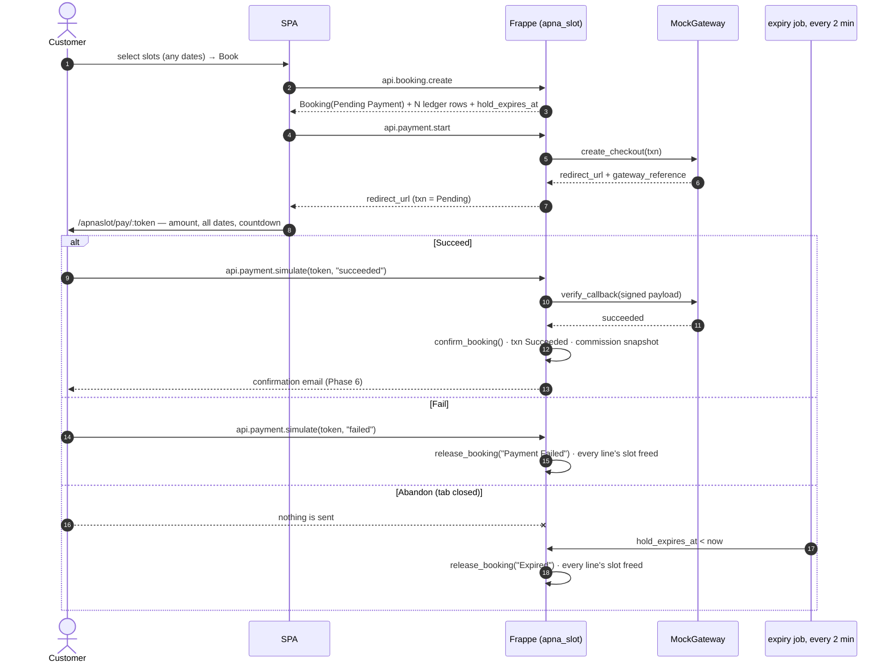

# Phase 4 — Mock Payments

**Goal:** a payment flow shaped exactly like a real one — hosted checkout, redirect, server-side
callback, signature verification, idempotency — with a `MockGateway` behind the interface. Swapping
in Razorpay or Stripe later is a new class, not a rewrite (D-16).

> **Already delivered by [Phase T](./phase-t-tracer.md).** The `PaymentGateway` ABC, `MockGateway`,
> the gateway registry, `Payment Transaction`, and `api.payment.start` / `get_checkout` /
> `simulate` / `callback` with HMAC signature verification, plus the bare checkout and mock-pay
> screens. **This phase adds:** the commission snapshot and its reconciliation (I-10), callback
> idempotency hardening, the expiry-beats-success refund path, transaction reuse and rate limiting,
> and the real checkout screen with its line table, rules acknowledgement and server-anchored
> countdown. There is no `confirm_internal` to delete — see the note in
> [phase-3-booking-engine.md](./phase-3-booking-engine.md).

## In scope

`Payment Transaction`, the `PaymentGateway` interface, `MockGateway`, the fake hosted checkout
page, the callback endpoint, commission snapshotting, and the Phase 3 → Phase 4 rewire.

## Out of scope

Real gateways, payouts, deposits, saved cards, taxes, invoices.

---

## 1. `Payment Transaction` — naming `PAY-.YYYY.-.#####`

| Fieldname | Fieldtype | Options | Notes |
|---|---|---|---|
| `booking` | Link | Booking | **reqd**, indexed |
| `publisher` | Link | Publisher | fetched, hidden |
| `gateway` | Data | | default `Mock` |
| `amount` | Currency | `currency` | **reqd** |
| `currency` | Link | Currency | snapshot from booking |
| `status` | Select | `Created`\|`Pending`\|`Succeeded`\|`Failed`\|`Abandoned`\|`Refunded` | default `Created` |
| `checkout_token` | Data | | **unique**, 32-char `frappe.generate_hash`; the `/pay/:token` path segment |
| `gateway_reference` | Data | | mock txn id, `MOCK-…` |
| `expires_at` | Datetime | | UTC, mirrors the booking's `hold_expires_at` |
| `callback_payload` | Code | JSON | raw callback body, for debugging |
| `failure_reason` | Small Text | | |

`checkout_token` is a bearer credential: unguessable, single-purpose, and expiring. It is never
logged and never appears in an error message.

---

## 2. The gateway interface — `apna_slot/gateways/base.py`

```python
class PaymentGateway(ABC):
    name: str

    @abstractmethod
    def create_checkout(self, txn: "PaymentTransaction") -> dict:
        """Return {"redirect_url": str, "gateway_reference": str}."""

    @abstractmethod
    def verify_callback(self, payload: dict) -> "CallbackResult":
        """Authenticate the callback and return outcome + gateway_reference.
        Must raise on a signature mismatch — never trust the caller's claimed outcome."""

    @abstractmethod
    def refund(self, txn: "PaymentTransaction", amount: Decimal, reason: str) -> dict:
        """Phase 6. Return {"reference": str, "status": str}."""
```

`CallbackResult` is a small dataclass: `outcome` (`succeeded` / `failed` / `abandoned`),
`gateway_reference`, `raw`.

`get_gateway(name)` resolves from a registry in `apna_slot/gateways/__init__.py`. The gateway name
is read from a site config key `apna_slot_payment_gateway`, defaulting to `Mock`.

### `MockGateway` — `apna_slot/gateways/mock.py`

- `create_checkout`: generates `MOCK-<hash8>` and returns
  `/apnaslot/pay/<checkout_token>` as the redirect URL.
- `verify_callback`: computes `hmac.new(site_secret, checkout_token + outcome).hexdigest()` and
  compares with `hmac.compare_digest`. A forged or replayed signature raises. This exists so the
  real gateway's signature step has a place to live and a test that already exercises it.
- `refund`: returns success after a short artificial delay.

The mock's realism is the entire point: the failure and abandonment paths are what exercise the
Phase 3 expiry job, which is the component most likely to be silently broken (D-16).

---

## 3. Flow



Abandonment deliberately does **not** release the booking immediately: a real customer who closes
the tab sends nothing at all, so the only honest release mechanism is the timer. The Abandon button
therefore simulates the *silence*, marking only the transaction.

### Callback rules

- **Idempotent.** A repeated callback for an already-`Succeeded` transaction returns the same
  result and does not re-confirm, re-email, or re-snapshot commission. Enforced by re-reading the
  transaction inside the transaction boundary and short-circuiting on a terminal status.
- **Authoritative outcome comes from `verify_callback`**, never from a client-supplied field.
- **Expiry beats success.** If the hold has already lapsed and the booking is `Expired`, a
  `succeeded` callback must **not** resurrect it — the slot may already belong to someone else.
  It marks the transaction `Succeeded` and raises a `Refund` (Phase 6) with reason
  `Hold expired before payment confirmation`. This is a real race with real money and it is
  specified, not left to chance.
- Never `frappe.throw` a raw exception to a gateway: return an HTTP 200 with a status body for
  handled cases, so a real gateway's retry logic behaves.

---

## 4. Commission snapshot (I-10, D-23)

On confirmation only:

```python
commission_percent      = publisher.commission_percent          # snapshot
commission_amount       = flt(net_amount * commission_percent / 100, precision)
publisher_payout_amount = flt(net_amount - commission_amount, precision)
```

At confirmation `net_amount == total_amount`; after any Phase 6 line cancellation both are
recomputed against the reduced `net_amount` using the already-snapshotted percentage.
Asserted to reconcile exactly: `commission_amount + publisher_payout_amount == net_amount`, with
any rounding residue assigned to the payout. No settlement or payout ledger exists (Phase 7).

---

## 5. APIs

| Method | Guest? | Params | Notes |
|---|---|---|---|
| `apna_slot.api.payment.start` | no | `booking` | Creates the transaction, calls `create_checkout`, returns `{"redirect_url", "checkout_token", "expires_at"}`. Refuses if the booking is not `Pending Payment` or the hold has lapsed. Reuses an existing `Pending` transaction rather than creating a second one. |
| `apna_slot.api.payment.get_checkout` | no | `token` | Booking summary for the fake hosted page: venue, resource, date, slots, amount, currency, `expires_at`. Owner only. |
| `apna_slot.api.payment.simulate` | no | `token`, `outcome` | **Mock only.** Computes the signature and posts it to `callback` — i.e. it plays the role of the gateway's server, so the callback is exercised exactly as it will be in production. Absent when the gateway is not `Mock`. |
| `apna_slot.api.payment.callback` | yes | `token`, `outcome`, `signature` | The webhook. Verifies, then applies the outcome. Idempotent. CSRF-exempt, rate-limited by token. |

`confirm_internal` from Phase 3 is **deleted** in this phase — the callback is now the only path to
`Confirmed`, and leaving a `System Manager` backdoor around invites it into production.

---

## 6. Frontend

| Route | Screen |
|---|---|
| `/apnaslot/checkout/:booking` | Order summary: venue, resource, and the **line table** — every date and time with its own price and the rule that set it, grouped by date, with the total. Plus the venue's rules as an acknowledgement checklist, the cancellation policy (noting it applies per date), and a **live countdown** to `hold_expires_at`. Primary button → `payment.start` → redirect. |
| `/apnaslot/pay/:token` | The fake hosted gateway. Deliberately *not* the app's design language — a plain centred card labelled "Mock Payment Gateway — no real money moves", the amount and a one-line summary ("6 sessions · Turf A · from 12 Sep"), a spinner with an artificial 1.5s delay, and `Succeed` / `Fail` / `Abandon`. |
| `/apnaslot/bookings/:name` | Result page after redirect: confirmed, failed, or expired, each with the appropriate next action. |

**Countdown behaviour.** Both checkout and the pay page count down to `expires_at` computed from
the server timestamp returned with the payload, not from the browser clock. At zero the page stops
polling and shows "This hold has expired" with a button back to the availability grid. Do not let a
customer pay into a lapsed hold when the client can already tell.

Components: `Card`-style layout with `bg-surface-*` tokens, `Badge` for status, `Button` variants
`solid` (Succeed), `outline` (Fail), `ghost` (Abandon), `toast` for outcomes, and `useCall` for
every request.

---

## 7. Acceptance criteria

1. Pay → Succeed confirms the booking, keeps the ledger rows, clears `hold_expires_at`, and
   snapshots commission that reconciles to the total.
2. Pay → Fail releases **every line's** slot immediately and sets `Payment Failed`; all of them are
   bookable again on the next grid read.
3. Pay → Abandon leaves the booking `Pending Payment`; the Phase 3 job expires it — releasing all
   lines — within one sweep after the hold lapses.
4. Replaying a `succeeded` callback changes nothing and sends no second email.
5. A callback with a tampered signature is rejected and the booking is untouched.
6. A `succeeded` callback arriving after expiry does **not** confirm; it raises a refund record for
   the full amount and says so.
6b. A six-line booking confirms as one unit: one transaction, one commission snapshot against the
    booking total, six ledger rows retained.
7. `payment.start` on a booking belonging to another customer is denied.
8. `payment.start` called twice returns the same transaction, not two.
9. `get_checkout` with an unknown or expired token returns a clean error, never a stack trace, and
   never echoes the token.
10. Switching `apna_slot_payment_gateway` to an unregistered name fails loudly at startup of the
    flow, not silently at callback time.

## 8. Tests — `apna_slot/tests/test_phase4.py`

| Test | Asserts |
|---|---|
| `test_start_creates_pending_transaction` | status + token + redirect url |
| `test_start_is_idempotent` | second call returns the same `PAY-` |
| `test_start_refused_after_hold_lapsed` | raises |
| `test_success_confirms_and_snapshots_commission` | I-10 reconciliation against `net_amount` |
| `test_multi_line_booking_confirms_atomically` | six lines, one txn, six ledger rows kept |
| `test_failure_releases_every_line` | zero ledger rows across all dates |
| `test_commission_rounding_residue_goes_to_payout` | sum equals total exactly |
| `test_failure_releases_slots` | zero ledger rows, status `Payment Failed` |
| `test_abandon_leaves_booking_pending` | expiry job then releases it |
| `test_callback_idempotent` | second call no-ops; one email |
| `test_callback_rejects_bad_signature` | raises, booking unchanged |
| `test_callback_after_expiry_does_not_confirm` | refund raised instead |
| `test_callback_outcome_not_taken_from_client` | client-claimed `succeeded` without a valid signature fails |
| `test_checkout_token_owner_only` | other customer denied |
| `test_gateway_registry_resolves_mock` | and raises on unknown names |
| `test_confirm_internal_removed` | attribute no longer exists — guards against the Phase 3 backdoor surviving |
