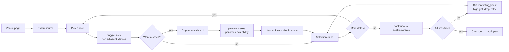

# Phase 5 — Customer Experience

**Goal:** the front door. A customer lands on the site, finds a venue by city and sport, sees a
real availability grid with real prices, picks slots — two hours tonight, or 7pm every Saturday for
six weeks — pays once, and can find the booking again afterwards.

This is the largest frontend phase in the plan and the one with the least new server logic — most
of the API surface already exists from Phases 2–4.

> **Already delivered by [Phase T](./phase-t-tracer.md).** `api.discovery.search_venues`
> (published venues, no filters), `get_venue` by slug with a 404 for unpublished, the bare venue
> page with a one-day grid and single-slot selection, and My Bookings as a flat list. **This phase
> adds:** every search filter, sort and pagination plus `get_filter_options`; the full venue page;
> cross-date selection with chips and caps; the repeat-weekly builder; the 409 `conflicting_lines`
> handling; stale-grid refetch; and the publisher booking list and calendar.

## In scope

Discovery and search, venue detail page, availability grid, multi-date slot selection and the
weekly-series builder, checkout wiring, My Bookings, and the publisher-side booking calendar.

## Out of scope

Maps (D-20), reviews and ratings, favourites, recommendations, cancellation (Phase 6).

---

## 1. Search — `apna_slot/api/discovery.py`

| Method | Guest? | Params |
|---|---|---|
| `search_venues` | yes | `q?`, `city?`, `activity_type?`, `amenities[]?`, `price_min?`, `price_max?`, `available_on?`, `sort?`, `page?`, `page_size?` |
| `get_venue` | yes | `slug` |
| `get_filter_options` | yes | — |

**`search_venues`** — built with `frappe.qb`, never string SQL.

- Base: `Venue.status = "Published"` joined to `Bookable Resource` (`status = "Active"`) so a venue
  with no live resource never appears.
- `q`: `LIKE` on `venue_name` and `city`. Full-text search is not worth it at this scale; the
  ceiling is documented in Phase 7.
- `activity_type`: exists-clause on the venue's resources.
- `amenities`: the venue must have **all** selected amenities (AND, not OR — a filter that returns
  more results as you add constraints is broken UX).
- `price_min` / `price_max`: against `MIN(base_price)` per venue. Deliberately matched on the base
  price, not on rule-resolved prices — resolving every rule for every venue to filter a list page
  is not affordable, and the venue card says "from AED 200" to match.
- `available_on` (a date): an exists-clause against the ledger — the venue must have at least one
  resource with fewer booked slots than generated slots that day. Computed with one aggregate
  query over `Booking Slot`, not by generating grids for every venue.
- `sort`: `relevance` (default) | `price_asc` | `price_desc` | `newest`.
- Pagination: `page_size` default 12, max 48; returns `{results, total, page, page_size}`.

Returns per venue: `slug`, `venue_name`, `city`, `cover_image`, `currency`, `from_price`,
`activity_types[]`, `amenities[]` (first 4), `resource_count`.

**`get_venue`** returns the venue with its images, rules, amenities, policy, and its active
resources each with `slot_duration_minutes`, `base_price` and `from_price`. Guest-visible;
`Draft` / `Unlisted` / `Suspended` return 404, never 403 — a 403 confirms the venue exists.

**`get_filter_options`** returns the distinct cities with published venues, plus the active
activity types and amenities. Cached for 10 minutes, invalidated on venue publish.

---

## 2. Frontend routes

| Route | Screen |
|---|---|
| `/apnaslot/` | Home: search bar (city + activity), filter sidebar, venue result grid |
| `/apnaslot/venues/:slug` | Venue detail + availability grid + slot selection |
| `/apnaslot/checkout/:booking` | Phase 4 |
| `/apnaslot/pay/:token` | Phase 4 |
| `/apnaslot/bookings` | My Bookings — Upcoming / Past / Cancelled tabs |
| `/apnaslot/bookings/:name` | Booking detail |
| `/apnaslot/manage/bookings` | Publisher booking list |
| `/apnaslot/manage/calendar` | Publisher day/week calendar per resource |

## 3. Home / discovery

- Hero with a single search: city `Combobox` + activity `Combobox` + date picker, all optional.
- Filter sidebar (drawer below `md`): activity type, amenities (`MultiSelect`), price range, date.
  Filters are URL query params so a filtered search is shareable and back-button-correct.
- Results: responsive card grid. Card = cover image, venue name, city, activity badges,
  "from {currency} {from_price}", amenity icons.
- Empty state names the filter to relax ("No venues in Pune with Floodlights — try clearing
  amenities"), not a generic "no results".
- Loading: skeleton cards, never a spinner over a blank page.
- Data: `useCall` on `search_venues`, debounced 300ms on filter change.

## 4. Venue detail and the grid

Layout: gallery, name/city, activity badges, description, amenity grid, rules list, cancellation
policy, contact — then the booking panel, which is the point of the page.

**Booking panel**

1. **Resource selector** — a `Tabs` or segmented control when the venue has more than one
   resource ("Turf A · Turf B · Badminton Court"). One resource: no selector, straight to the grid.
2. **Date strip** — 14 days horizontally scrollable, each showing weekday, date, and an
   availability dot fed by `availability.get_range`. A full-day-booked date is visibly struck out
   before the customer clicks it.
3. **Slot grid** — `availability.get_day`. Buttons in a responsive grid, each showing the time and
   the resolved price:
   - `available` → selectable, price shown;
   - `booked` → disabled, muted, label "Booked";
   - `closed` → disabled with the closure reason as a tooltip;
   - `past` / `beyond_window` → hidden by default behind a "show earlier" toggle.
4. **Multi-slot selection (D-28)** — slots toggle independently and **need not be adjacent**:
   10:00 and 19:00 on the same day is a valid two-line booking. The only limits are
   `max_slots_per_booking` per date (further slots on that date disable, with the cap shown) and
   `max_dates_per_booking` overall.
5. **Selection persists across dates.** Moving the date strip to another day keeps earlier
   selections; a summary chip row above the grid shows every chosen date/time with an × to remove
   one — otherwise a customer who picks three dates has no way to see or undo the first two.
6. **Repeat weekly** — the series builder. With at least one slot selected on one date, a
   `Repeat weekly` control offers 2–`max_dates_per_booking` weeks. Choosing 6 calls
   `availability.preview_series` and renders a checklist of the six dates, each marked available,
   `booked`, `closed` or `beyond the venue's 60-day window`, with unavailable weeks unchecked and
   explained. The customer books the weeks that work; nothing is silently dropped (D-29).
7. **Summary bar** — sticky at the bottom on mobile: "6 sessions · Turf A · from 12 Sep · AED 1,500"
   with an expandable line list, and a `Book now` button. Guests are routed to login with a
   `redirect` back to the exact selection (encoded in the query string, so it survives the round
   trip).

8. **Stale-grid handling** — refetch the grid on window focus and every 60s while the page is
   open; if any selected slot on the visible date has become `booked`, deselect it and toast "That
   slot was just taken". Selections on other dates are re-validated server-side at `create`, which
   is why the 409 `conflicting_lines` path (D-29) exists rather than being an edge case.

**Components:** `Tabs`, `Badge`, `Button`, `Dialog` for the gallery lightbox, `ScrollArea` for the
date strip, `Skeleton` while loading, `toast` for conflicts. Colors strictly through
`bg-surface-*` / `text-ink-*` / `border-outline-*`; a booked slot uses a muted surface, not a raw
grey.

**Accessibility:** the grid is a list of real `<button>`s with `aria-pressed`, keyboard-navigable,
and each slot's accessible name reads "7 PM to 8 PM, 250 dirhams, available" — a price-only label
is unusable with a screen reader.

## 5. My Bookings

- Tabs Upcoming / Past / Cancelled over `booking.list_mine`.
- Row: venue name, resource, the **next** upcoming date with "+ 5 more dates" when the booking is
  a series, status `Badge`, amount. A series is one row, never six.
- Sorting is by `first_start_utc`; a partially-cancelled series shows "2 of 6 dates cancelled" as a
  muted subtitle rather than an invented status.
- Detail page: the full line table (date, time, price, rule, per-line status), the venue's
  rules and contact, cancellation policy with the deadline computed from
  `free_cancellation_hours`, and (Phase 6) the Cancel action.
- Empty state links to discovery.

## 6. Publisher-side booking views

- `/manage/bookings`: filterable list (venue, resource, date range, status), `List`/`ListRow`,
  with customer name and phone visible — the venue needs to call the customer.
- `/manage/calendar`: day and week view per resource, slots as blocks coloured by status, closures
  shaded. A block belonging to a series is marked ("3 of 6") so a publisher cancelling one date
  knows the customer has others. Reads `availability.get_day` plus a publisher-only variant that includes the booking
  reference and customer name on booked slots.
- Both are read-only here; cancellation arrives in Phase 6.

---

## 7. Acceptance criteria

1. A guest searching by city sees only published venues with at least one active resource.
2. Selecting two amenities narrows results (AND semantics).
3. Filters round-trip through the URL; a shared filtered URL reproduces the same result set.
4. A venue page for an unlisted slug returns 404, not 403.
5. The grid shows correct statuses and prices, matching `get_day` exactly.
6. Selecting non-adjacent slots on one date produces one booking with two lines.
6b. `Repeat weekly × 6` with week 3 already booked shows week 3 unavailable and unchecked; booking
    the other five succeeds and creates five lines.
6c. A `create` that hits a conflict returns 409, the UI highlights the offending dates, and
    re-submitting without them succeeds.
7. A guest clicking `Book now` logs in and returns to the same venue, date and selection.
8. Booking flows end-to-end: select → (optionally repeat weekly) → checkout → mock pay → confirmed
   → one row in My Bookings showing all dates.
9. A slot booked by another user while the page is open is deselected with a toast on refetch.
10. Everything is usable at 375px width; the grid never causes horizontal page scroll.
11. Light and dark mode both render correctly with no hard-coded colors.
12. Publisher calendar shows customer names on booked slots; a customer-facing grid never does.

## 8. Tests

**Server — `apna_slot/tests/test_phase5.py`**

| Test | Asserts |
|---|---|
| `test_search_excludes_unpublished` | draft/unlisted absent |
| `test_search_excludes_venue_without_active_resource` | |
| `test_amenity_filter_is_and` | two amenities narrow |
| `test_price_filter_uses_min_base_price` | |
| `test_available_on_filter_excludes_fully_booked` | one aggregate query, asserted with `count_queries` |
| `test_get_venue_unlisted_returns_404` | not 403 |
| `test_search_pagination_bounds` | page_size capped at 48 |
| `test_publisher_grid_includes_customer_name` | and the public one does not |
| `test_preview_series_marks_unavailable_weeks` | booked / closed / beyond-window reasons |
| `test_preview_series_respects_max_dates` | capped at the resource's limit |
| `test_search_query_budget` | list page stays under a fixed query count |

**Frontend:** component tests for multi-date selection state and the caps (pure functions in
`src/lib/slotSelection.js` — `toggleSlot`, `expandWeekly`, `dropConflicts` — extracted precisely so
they are testable without a browser), plus one manual
end-to-end pass on the acceptance list above.
