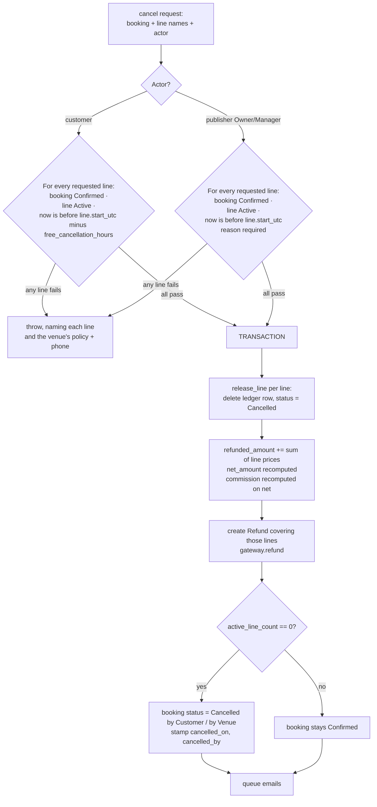

# Phase 6 — Lifecycle: Cancellation, Refunds, Notifications

**Goal:** bookings can end well. A customer cancels a booking — or a single date out of a series —
within policy and gets a (mock) refund for exactly those lines; a venue cancels with a reason;
slots return to inventory immediately; everyone gets told by email.

> **Already delivered by [Phase T](./phase-t-tracer.md).** `release_booking`, which every
> cancellation path below builds on, and the `gateway.refund()` method signature on the
> `PaymentGateway` interface. Everything else in this phase is additive.

## In scope

`Refund`, line-level and whole-booking cancellation, the policy window, email templates, the
reminder job.

## Out of scope

Tiered refund percentages, rescheduling, no-show handling, SMS/WhatsApp, real refunds (Phase 7).

---

## 1. `Refund` — naming `REF-.YYYY.-.#####`

One refund per **cancellation event**, not per booking — cancelling two dates out of six raises one
refund for those two lines (D-31).

| Fieldname | Fieldtype | Options | Notes |
|---|---|---|---|
| `booking` | Link | Booking | **reqd**, indexed |
| `payment_transaction` | Link | Payment Transaction | **reqd** |
| `publisher` | Link | Publisher | fetched, hidden |
| `lines` | Table | Refund Line | **reqd** — which booking lines this refund covers |
| `amount` | Currency | `currency` | **reqd**, = sum of the covered lines' prices |
| `currency` | Link | Currency | snapshot |
| `status` | Select | `Pending`\|`Succeeded`\|`Failed` | default `Pending` |
| `reason` | Select | `Cancelled by Customer`\|`Cancelled by Venue`\|`Hold expired after payment`\|`Other` | **reqd** |
| `reason_note` | Small Text | | |
| `gateway_reference` | Data | | from `gateway.refund()` |
| `refunded_on` | Datetime | | |

**`Refund Line` (child)**: `booking_line` (Data — the child row name), `line_date` (Date),
`start_time` (Time), `amount` (Currency).

A booking line may appear in at most one `Succeeded` refund; attempting a second raises.

---

## 2. Cancellation

Cancellation operates on **lines**. Cancelling a whole booking is cancelling all of its active
lines in one event.



### Customer cancellation

```python
def cancel_by_customer(booking_name: str, line_names: list[str] | None = None,
                       reason: str = "") -> dict
    """line_names=None cancels every active line."""
```

A line is cancellable by the customer only when the booking is `Confirmed`, the line is `Active`,
and `now_utc <= line.start_utc - free_cancellation_hours`. Because each line has its own start
time, **a series can be partly cancellable**: with a 24-hour policy on a Saturday series, tomorrow's
line is locked while the remaining five are free. The API reports this per line and the UI shows it
per line — a single disabled "Cancel" button for a six-week series would be wrong.

**All-or-nothing per request:** if any requested line fails the check, nothing is cancelled and the
error names each failing line. The UI's job is to request only the lines it was told are
cancellable.

Refusal messages stay specific: *"12 Sep 19:00 can no longer be cancelled online — Green Field
Sports allows cancellation up to 24 hours before the start time. Call +971… to speak to the venue.
Your other 5 dates can still be cancelled."*

`free_cancellation_hours = 0` means cancellation is allowed right up to each line's start.

### Venue cancellation

```python
def cancel_by_venue(booking_name: str, line_names: list[str] | None = None,
                    reason: str = "") -> dict
```

- Any Publisher member with `Owner` or `Manager` role, on their own booking.
- Allowed any time before a line's `start_utc`. **No policy window applies to the venue** — if a
  venue has to close, the customer is not held to a deadline.
- `reason` is **mandatory** and is shown to the customer verbatim in the email.
- Always a full refund of the cancelled lines, regardless of timing.

Neither path may touch a line whose `start_utc` has passed or that is `Completed`; that is a
dispute, not a cancellation, and is handled off-platform in this phase.

**Closures do not auto-cancel** (Phase 1). When a publisher creates a closure overlapping confirmed
lines, the UI lists **the affected lines** — which may be one date of a six-date series — with a
"Cancel these dates" action calling `cancel_by_venue` with exactly those line names and the closure
reason pre-filled. Cancelling a customer's booking is always an explicit, attributable act.

### Money after a partial cancellation

`total_amount` never changes (I-6). `refunded_amount` accumulates, `net_amount` follows, and
`commission_amount` / `publisher_payout_amount` are recomputed against `net_amount` using the
already-snapshotted `commission_percent` (I-10). A publisher's payout shrinks when a date is
refunded; their commission rate does not get renegotiated retroactively.

---

## 3. Notifications — `apna_slot/notifications.py`

Frappe `Email Template` records shipped as fixtures, rendered with Jinja, queued via
`frappe.sendmail(..., queue=True)` so no request ever blocks on SMTP.

| Template | Trigger | To |
|---|---|---|
| `apna_slot_booking_confirmed` | Phase 4 success callback | customer (cc venue contact) |
| `apna_slot_booking_notice_venue` | same | venue contact |
| `apna_slot_booking_cancelled_customer` | `cancel_by_customer` | customer + venue |
| `apna_slot_booking_cancelled_venue` | `cancel_by_venue` | customer (with the reason) + venue |
| `apna_slot_refund_processed` | refund `Succeeded` | customer |
| `apna_slot_booking_reminder` | 2 hours before a line's `start_utc` | customer |

Every email renders: venue name and address, resource, **venue-local** dates and times with the
timezone abbreviation spelled out (`19:00–21:00 GST`), amounts in the venue's currency, the booking
id, and the venue's rules. A booking email showing the recipient's local time instead of the
venue's is a person arriving three hours early.

**Multi-line rendering.** Confirmation and cancellation emails list every affected date as a table,
and say what remains: *"Cancelled: 19 Sep, 26 Sep. Still booked: 3 Oct, 10 Oct, 17 Oct."* A
cancellation email for a series that does not say which dates survived is worse than no email.

**Reminders are per line**, not per booking, and each names its position: *"Your booking tomorrow
at 19:00 — 3 of 6 in your series."* `Booking Line.reminder_sent` makes it idempotent.

### Reminder job

```python
scheduler_events = {"cron": {"*/15 * * * *": ["apna_slot.jobs.send_booking_reminders"]}}
```

Selects `Booking Line` rows where `status = "Active"`, `reminder_sent = 0`, the parent booking is
`Confirmed`, and `start_utc` falls between `now + 105 min` and `now + 135 min` — a window wider
than the sweep interval so a delayed run does not silently skip a line, with the flag preventing
duplicates. This is the job that justifies line-level `start_utc` existing at all: one indexed
range query across every venue in every timezone, hitting individual dates of series that may be
months apart.

---

## 4. APIs

| Method | Params | Notes |
|---|---|---|
| `apna_slot.api.booking.cancel` | `booking`, `lines[]?`, `reason?` | Customer path. Omit `lines` to cancel everything still active. Enforces the window per line. |
| `apna_slot.api.booking.cancel_as_venue` | `booking`, `lines[]?`, `reason` | Publisher path. `reason` required. |
| `apna_slot.api.booking.get_cancellation_policy` | `booking` | Per line: `{line, line_date, start_time, can_cancel, deadline_utc, deadline_local, reason_if_not}`, plus `hours` and `refundable_amount` for the currently-cancellable set. The UI must never compute deadlines itself and disagree with the server. |

---

## 5. Frontend

- **Booking detail (customer)**: the lines table is the centre of the screen — date, time, price,
  status, and a per-line checkbox enabled only where `can_cancel`. A "Select all cancellable"
  action, a running "You'll be refunded AED 500" total, and one `Cancel selected` button. Lines
  that cannot be cancelled show the reason inline ("Less than 24h before start — call the venue")
  rather than an unexplained disabled checkbox.
- Above the table, the policy panel states the rule once and shows the venue's phone number.
- **Booking detail (publisher)**: the same line table with a **required** reason `Textarea` in the
  confirm dialog, and a warning that the customer will be emailed the reason verbatim.
- **Closures screen**: overlapping **lines** listed with their bookings, per-line and bulk cancel.
- **Status badges** everywhere use one shared map, and a partially-cancelled booking renders as
  `Confirmed` with a muted "2 of 6 dates cancelled" subtitle — never as its own invented status.
- After cancellation: `toast.success`, line rows update in place, the refund appears with its
  status. No page reload.

---

## 6. Acceptance criteria

1. A single-line booking 48h out, with a 24h policy, is cancellable; the slot is immediately
   available to other customers; a full-amount `Refund` is created and reaches `Succeeded`.
2. In a six-date series with a 24h policy where the first date is tomorrow, `get_cancellation_policy`
   returns `can_cancel = false` for that line and `true` for the other five.
3. Cancelling those five leaves the booking `Confirmed` with `active_line_count = 1`, a refund for
   exactly five lines' prices, and five freed slots.
4. Cancelling the last remaining line moves the booking to `Cancelled by Customer` and stamps
   `cancelled_on`.
5. `total_amount` is unchanged by any cancellation; `refunded_amount` equals the sum of cancelled
   line prices; `net_amount` and commission reconcile (I-10).
6. A cancel request including one non-cancellable line cancels **nothing** and names that line.
7. The venue can cancel a line 12h out; a reason is mandatory and appears in the customer's email.
8. A `Pending Payment` booking cannot be cancelled through either path; it expires.
9. A `Completed` line cannot be cancelled.
10. Cancelling the same line twice raises and does not create a second refund.
11. `free_cancellation_hours = 0` permits cancellation up to each line's start.
12. Emails list affected dates and surviving dates, in venue-local time, for two venues in
    different timezones.
13. The reminder fires once per **line**, roughly 2 hours before that line's start, and a six-date
    series produces six reminders across six weeks.
14. A closure overlapping one date of a series lists only that line and cancels nothing until the
    publisher acts.
15. Emails are queued, not sent inline — the cancellation API returns without waiting on SMTP.

## 7. Tests — `apna_slot/tests/test_phase6.py`

| Test | Asserts |
|---|---|
| `test_cancel_single_line_booking_inside_window` | status, zero ledger rows, refund |
| `test_partial_series_cancellation_keeps_booking_confirmed` | `active_line_count` drops, status unchanged |
| `test_cancelling_last_line_cancels_booking` | status + `cancelled_on` |
| `test_policy_is_per_line_not_per_booking` | mixed cancellable/locked series |
| `test_cancel_request_with_one_bad_line_is_atomic` | nothing cancelled |
| `test_refund_amount_equals_cancelled_lines` | not the booking total |
| `test_total_amount_never_changes` | I-6 |
| `test_net_and_commission_recomputed` | I-10 reconciliation after partial refund |
| `test_line_cannot_be_refunded_twice` | second attempt raises |
| `test_zero_hour_policy_allows_until_start` | |
| `test_cannot_cancel_pending_payment` / `test_cannot_cancel_completed_line` | |
| `test_venue_cancel_ignores_window` | allowed at 12h |
| `test_venue_cancel_requires_reason` | raises without one |
| `test_venue_cancel_by_staff_denied` | `member_role = Staff` |
| `test_cross_tenant_cancel_denied` | I-8 |
| `test_slots_rebookable_after_line_cancel` | a second customer books the freed date |
| `test_reminder_sent_once_per_line` | flag prevents a second send |
| `test_series_produces_one_reminder_per_line` | six lines, six reminders |
| `test_reminder_window_catches_delayed_run` | 30-minute window |
| `test_reminder_uses_venue_local_time_in_body` | two timezones |
| `test_cancellation_email_lists_affected_and_remaining` | both sets present |
| `test_emails_are_queued_not_inline` | Email Queue row, no SMTP call |
| `test_closure_lists_affected_lines_only` | one line of a series |
| `test_cancellation_policy_api_matches_enforcement` | `can_cancel` agrees with the actual call, per line |
