# Phase T — Tracer Bullet (the walking skeleton)

**Goal:** one thin, ugly, *complete* path through every layer of the system — signup, publisher,
venue, resource, availability grid, booking, mock payment, confirmation, My Bookings — with the
double-booking guarantee already in place.

Nothing here is a throwaway prototype. Every line written in Phase T survives into Phase 6; the
later phases *thicken* this skeleton rather than replace it. What Phase T deliberately omits is
**breadth**, never **depth**: the one path it builds is built properly, with its unique index, its
timezone conversion, its permission hook and its test.

> **Why this phase exists.** The original plan ran horizontally — foundations, then listing, then
> pricing, then the engine, then payments. Nothing was bookable until Phase 4, which meant the six
> architectural bets below went unvalidated for four phases. Tracer bullets fire one round through
> the whole system first and watch where it lands.

---

## 1. The bets this phase settles

A tracer bullet is chosen by **risk**, not by feature value. These six are the assumptions that,
if wrong, invalidate the plan. Each gets a named test in this phase.

| # | Bet | Fails how | Test |
|---|---|---|---|
| **R1** | A MariaDB unique index on `(resource, slot_date, start_time)` is a sufficient double-booking guarantee under real concurrency (I-1, D-17) | Two customers hold the same slot; the ledger is a lie | `test_concurrent_booking_same_slot_one_wins` |
| **R2** | Local wall-clock storage plus a denormalised UTC instant round-trips correctly through `ZoneInfo` (D-9) | Every reminder, completion job and email is wrong by hours | `test_line_utc_matches_venue_timezone` |
| **R3** | `permission_query_conditions` + `has_permission` isolate tenants and **fail closed** (I-8) | Publisher A reads Publisher B's bookings | `test_query_conditions_fail_closed_for_non_member` |
| **R4** | A hand-scaffolded frappe-ui SPA at `/apnaslot` builds, serves and authenticates on session cookies (D-27) | The entire frontend plan is wrong | E2E journey T-1 |
| **R5** | A gateway interface with a signed callback can drive the booking state machine (D-16) | Phase 4 is a rewrite, not a new class | `test_callback_confirms_booking` |
| **R6** | A Frappe scheduled job reliably releases abandoned holds (D-6) | Inventory silently leaks | `test_expiry_job_releases_hold` |

R1 is the reason the ledger and its patch appear in the *first* phase rather than the fourth. A
booking system whose exclusivity guarantee is unproven has no architecture yet.

---

## 2. The one path

```mermaid
flowchart LR
    A[signup] --> B[create Publisher]
    B --> C[create Venue + 1 Resource<br/>Mon-Sun 18:00-22:00 @ 60min]
    C --> D[publish]
    D --> E[customer opens venue page]
    E --> F[day grid: 4 slots]
    F --> G[pick ONE slot]
    G --> H[booking.create<br/>Pending Payment + 1 ledger row]
    H --> I[payment.start -> /pay/:token]
    I --> J[Succeed -> signed callback]
    J --> K[Confirmed]
    K --> L[My Bookings]
```



Concretely, the acceptance walk is: `asha@example.com` signs up, becomes a publisher, lists
*Green Field Sports Arena* with *Turf A* open 18:00–22:00 every day at AED 250 per hour, publishes
it; `raj@example.com` signs up, finds the venue, books tomorrow 19:00–20:00, pays with the mock
gateway, and sees the confirmed booking. A second browser trying the same slot is refused.

---

## 3. In scope

### DocTypes — 8 of the eventual 18, each at minimum field set

| DocType | Module | Fields shipped in T | Deferred to |
|---|---|---|---|
| `Publisher` | Core | `publisher_name`, `status`, `contact_email`, `currency`, `timezone`, `members` | Phase 0: `commission_percent`, `payout_details`, `contact_phone` |
| `Publisher Member` (child) | Core | `user`, `member_role` | — |
| `Venue` | Core | `venue_name`, `publisher`, `slug`, `status`, `city`, `country`, `address_line_1`, `timezone`, `currency`, `max_advance_days`, `min_lead_minutes` | Phase 1: images, amenities, rules, policy text, geo, `free_cancellation_hours` |
| `Bookable Resource` | Core | `resource_name`, `venue`, `publisher`, `status`, `currency`, `slot_duration_minutes`, `base_price`, `weekly_schedule`, `max_slots_per_booking`, `max_dates_per_booking` | Phase 1: `activity_type`, images, description; Phase 2: `price_rules` |
| `Resource Schedule Row` (child) | Core | `day_of_week`, `opens_at`, `closes_at` | — |
| `Booking` | Booking | `customer`, `publisher`, `venue`, `resource`, `lines`, `line_count`, `active_line_count`, `first_start_utc`, `last_end_utc`, `timezone`, `currency`, `total_amount`, `status`, `hold_expires_at` | Phase 4: commission; Phase 6: cancellation, `refunded_amount` |
| `Booking Line` (child) | Booking | `line_date`, `start_time`, `end_time`, `start_utc`, `end_utc`, `price`, `price_rule`, `status` | Phase 6: cancellation fields, `reminder_sent` |
| `Booking Slot` | Booking | `resource`, `slot_date`, `start_time`, `end_time`, `booking`, `booking_line`, `publisher` | — **complete in T** |

`Booking Slot` ships whole because it *is* the guarantee. Everything else ships thin.

The `Booking Line` child table ships in Phase T with exactly one row per booking. The shape from
D-28 is therefore proven from the first commit; Phase 3 only exercises it with more rows. Building
a flat single-date Booking here and migrating later would be the one shortcut that costs more than
it saves.

### The unique index

`apna_slot/patches/v1_0/add_booking_slot_unique_index.py`, registered in `patches.txt`, exactly as
specified in [phase-3-booking-engine.md](./phase-3-booking-engine.md) §1. It ships in **this**
phase. `test_unique_index_exists` reads `information_schema` and fails loudly if the patch was
skipped.

### Server modules

| Module | Ships in T | Deferred |
|---|---|---|
| `apna_slot/permissions.py` | `get_user_publishers`, `tenant_query`, `tenant_has_permission`, registered for the 4 tenant doctypes | per-doctype specialisations, `member_role` gradations (Phase 0/1) |
| `apna_slot/availability.py` | `AvailabilityGrid.for_date()` — schedule → ZoneInfo localisation → ledger subtraction → window check | closures, DST skip/fold filter, `for_dates()` batching, price rules (Phases 1–3) |
| `apna_slot/pricing.py` | `PriceResolver` returning `base_price` and the label `Base Price` | rule matching, priority, `quote()` across dates (Phase 2) |
| `apna_slot/booking_engine.py` | `create_booking` (single line), `confirm_booking`, `release_booking` | `release_line`, `expand_weekly_series`, multi-line all-or-nothing (Phase 3) |
| `apna_slot/jobs.py` | `expire_pending_bookings` (every 2 min) | `complete_past_lines`, `send_booking_reminders` |
| `apna_slot/gateways/` | `PaymentGateway` ABC, `MockGateway`, registry | `refund()` body (Phase 6) |
| `apna_slot/constants.py` | `HOLD_MINUTES = 10` | — |

`PriceResolver` returning a constant is not wasted work: Phase 2 replaces its **body**, and every
caller — grid, quote, booking creation — is already wired through the seam.

### APIs

| Method | Guest? | Notes |
|---|---|---|
| `api.auth.sign_up` | yes | rate-limited; `Apna Slot Customer` role; logs in |
| `api.auth.get_session_user` | yes | SPA bootstrap payload |
| `api.publisher.create_publisher` | no | caller becomes `Owner`; no `contact_phone` until Phase 0 adds the field |
| `api.discovery.search_venues` | yes | **T version:** published venues only, no filters, no pagination |
| `api.discovery.get_venue` | yes | by slug; 404 for unpublished |
| `api.availability.get_day` | yes | one resource, one date |
| `api.booking.create` | no | one slot; 409 with `conflicting_lines` on collision |
| `api.booking.list_mine` | no | flat list |
| `api.payment.start` / `.get_checkout` / `.simulate` / `.callback` | mixed | exactly the Phase 4 contract |

Venue and resource creation in Phase T go through the standard `frappe.client` REST layer — no
custom endpoint, no wizard. Reading them back is asymmetric on purpose: a publisher lists their own
venues through that same REST layer under `tenant_query`, while customers and guests read only
through `api.discovery`, which filters on `status = "Published"` itself (D-34). The Venue doctype
grants `Guest` nothing.

### Frontend — 8 screens, deliberately plain

`/apnaslot/signup` · `/apnaslot/login` · `/apnaslot/` (venue list) · `/apnaslot/venues/:slug`
(day grid, one slot selectable) · `/apnaslot/checkout/:booking` · `/apnaslot/pay/:token` ·
`/apnaslot/bookings`.

Plus two publisher screens: `/apnaslot/manage/onboarding`, the create-your-business form that
`create_publisher` needs and the `requiresPublisher` guard redirects to, and
`/apnaslot/manage/venues`, which lists venues and links to a bare create-venue form. No wizard,
no tabs, no schedule builder, no calendar.

Styling is frappe-ui components and `bg-surface-*` / `text-ink-*` / `border-outline-*` tokens from
the start — the tokens are free and retrofitting hard-coded colours is not.

---

## 4. Out of scope

Explicitly *not* in Phase T, and each has a phase that owns it:

Activity types and amenities · venue images, rules, policy text · closures · price rules and the
resolver · multi-slot and multi-date selection · the weekly-series builder · search filters and
pagination · publisher CRUD wizards, schedule builder, pricing calendar, booking calendar ·
cancellation and refunds · every email · the completion and reminder jobs · DST edge handling ·
commission.

---

## 5. Build order inside the phase

Each step is committed separately and leaves the app runnable.

1. **T-a — Skeleton up.** `hooks.py`, `modules.txt` (two modules), `www/apnaslot.py`,
   `website_route_rules`, the Vite/Tailwind/frappe-ui scaffold, one page that renders "Apna Slot".
   *Proves R4 before a single doctype exists.*

   The frappe-ui vite plugin, given `frontendRoute: '/apnaslot'`, derives the whole build contract
   from D-27 on its own — output to `apna_slot/public/frontend`, base `/assets/apna_slot/frontend/`,
   and **it generates `apna_slot/www/apnaslot.html`** from `frontend/index.html` at build time. That
   file is therefore a build artefact and gitignored alongside `public/frontend`; a fresh clone
   needs `yarn build` (or `bench build --app apna_slot`) before the route resolves. The
   hand-written half is `www/apnaslot.py`, which supplies `context.boot` — the plugin's
   `jinjaBootData` transform emits each key as `window[key]`, which is how `csrf_token` reaches
   frappe-ui.
2. **T-b — Identity.** `Publisher` + `Publisher Member`, `permissions.py`, signup/session APIs,
   login, signup and onboarding screens. *Proves R3.*

   The two roles ship as a fixture file, `apna_slot/fixtures/role.json`, which `migrate` imports
   after the doctype sync — DocType JSON is imported with `ignore_links`, so a permission row may
   name a role that does not exist yet. Session changes (login, signup, logout) leave the SPA with
   `window.location.href` rather than routing: a new session issues a new CSRF token, and only a
   page load re-renders `www/apnaslot.py`'s boot data with it.
3. **T-c — Inventory.** `Venue`, `Bookable Resource`, `Resource Schedule Row`, publish, the
   publisher's venue list and bare create form, and the public list that publishing feeds —
   `api.discovery.search_venues`. Publishing is only observable through a reader who is not the
   publisher, so both ends of D-34 ship together. `get_venue` waits for T-d, which owns the venue
   page it serves.
4. **T-d — The ledger.** `Booking Slot` + the unique-index patch, `Booking` + `Booking Line`,
   `AvailabilityGrid.for_date`, `PriceResolver`, `create_booking`, `api.discovery.get_venue`, the
   venue page with its day grid, and the checkout screen as a **shell** — the hold, its lines and
   its countdown, with no payment in it. *Proves R1 and R2.* **This is the step the whole phase
   exists for.**

   The shell is not a placeholder: creating a hold with nowhere to land would be, and T-e adds the
   gateway to this page rather than replacing it.
5. **T-e — Money.** Gateway ABC, `MockGateway`, `Payment Transaction`, start/callback, the checkout
   and mock-pay screens, `confirm_booking` **and `release_booking`**. *Proves R5.*

   `release_booking` was drafted into T-f with the expiry job, but the Fail button needs it here:
   acceptance criterion 9 says a failed payment frees the slot on the next grid read, not on the
   next sweep. T-f inherits it rather than writing it.

   The expiry-beats-success guard ships whole — a `succeeded` callback for a lapsed hold marks the
   transaction and leaves the booking alone. The `Refund` it owes the customer is Phase 6's, and
   [phase-4-mock-payments.md](./phase-4-mock-payments.md) §3 already owns that half.
6. **T-f — The timer.** `expire_pending_bookings`, My Bookings. *Proves R6.*

   Each lapsed hold is released under its own savepoint, so one bad record is logged and skipped
   rather than stalling the sweep. My Bookings is a flat list over `booking.list_mine`, one row per
   booking naming its earliest line, reached from the account menu; Phase 5 adds the tabs.

If a step cannot be completed as specified, **stop and amend the specs before continuing** — a
tracer bullet that lands somewhere unexpected is information, not a defect to work around.

---

## 6. Acceptance criteria

1. `/apnaslot` builds and serves with no console errors, light and dark.
2. A new user signs up and lands authenticated, with the `Apna Slot Customer` role.
3. A user creates a Publisher, gains `Apna Slot Publisher`, creates and publishes a venue with one
   resource open 18:00–22:00 at 60 minutes.
4. Publisher B cannot list or read Publisher A's venue; a user with no membership sees an **empty**
   list, never every venue.
5. The venue page for that resource shows exactly 4 slots for tomorrow, each at `base_price`.
6. Booking 19:00 creates a `Pending Payment` booking with one line, one ledger row, and
   `hold_expires_at = now + 10 minutes`.
7. The line's `start_utc` equals 19:00 in the venue's timezone converted to UTC — asserted for a
   venue in `Asia/Dubai` and one in `Asia/Kolkata`.
8. Mock pay → Succeed confirms the booking, clears `hold_expires_at`, keeps the ledger row, and the
   booking appears in My Bookings.
9. Mock pay → Fail releases the slot; it is bookable again on the next grid read.
10. Abandoning the tab leaves the booking `Pending Payment`; the expiry job releases it within one
    sweep after the hold lapses.
11. Two concurrent `create` calls for the same slot: one booking, one ledger row, one clean
    `SlotUnavailableError`.
12. A callback with a tampered signature is rejected and the booking is untouched.
13. The unique index exists in `information_schema`.

## 7. Tests — `apna_slot/tests/test_tracer.py` and `test_expiry.py`

| Test | Bet | Asserts |
|---|---|---|
| `test_unique_index_exists` | R1 | index present in `information_schema.statistics` |
| **`test_concurrent_booking_same_slot_one_wins`** | **R1** | two threads, two `frappe.connect` connections; one booking, one ledger row, one error |
| `test_duplicate_ledger_insert_rolls_back_booking` | R1 | no orphan Booking after a collision |
| `test_line_utc_matches_venue_timezone` | R2 | Dubai and Kolkata venues, same local 19:00, different `start_utc` |
| `test_grid_generation_counts_slots` | — | 18:00–22:00 @ 60min ⇒ 4 slots |
| `test_grid_marks_booked_from_ledger` | — | held slot reads `booked` for a second user |
| `test_query_conditions_scope_to_membership` | R3 | A sees only A |
| `test_query_conditions_fail_closed_for_non_member` | R3 | condition is `1=0`, list is empty |
| `test_signup_creates_customer_role` | — | role + `user_type == "Website User"` |
| `test_signup_logs_the_new_customer_in` | R4 | `get_session_user` returns the new user, not Guest |
| `test_create_publisher_grants_publisher_role` | R3 | role granted; the publisher shows up in the session payload |
| `test_start_opens_a_hosted_checkout` | R5 | the gateway hands over the URL; transaction `Pending` |
| `test_start_reuses_a_live_transaction` | R5 | one transaction per hold |
| `test_start_refuses_a_booking_that_is_no_longer_held` | R5 | a settled booking cannot be paid for |
| `test_get_checkout_refuses_someone_elses_token` | R5 | the bearer token reads 404 for the wrong holder |
| `test_callback_confirms_booking` | R5 | `Confirmed`, hold cleared, ledger row kept |
| `test_callback_rejects_bad_signature` | R5 | raises; booking untouched |
| `test_callback_is_idempotent` | R5 | a repeated callback returns the same result and re-confirms nothing |
| `test_payment_failure_releases_slot` | R5 | zero ledger rows; the grid reads `available` again |
| `test_abandonment_leaves_the_hold_alone` | R5 | still `Pending Payment`, ledger row intact |
| `test_success_after_expiry_does_not_resurrect_the_booking` | R5 | transaction `Succeeded`, booking stays `Expired` |
| `test_release_booking_is_idempotent` | R6 | called twice, one result, no raise |
| `test_expiry_job_releases_hold` | R6 | `Expired`, zero ledger rows, the grid reads `available` |
| `test_expiry_job_leaves_a_live_hold_alone` | R6 | a hold inside its 10 minutes survives the sweep |
| `test_expiry_job_ignores_confirmed` | R6 | still `Confirmed`, ledger row kept |
| `test_expiry_job_survives_a_bad_record` | R6 | one failing release is logged; the next hold still expires |
| `test_list_mine_shows_only_the_callers_bookings` | — | another customer's hold is absent; the row names its line |

The R6 tests live in `test_expiry.py`, on their own committed arena, to keep `test_tracer.py`
within a readable size.

**E2E — journeys T-1, T-2, T-3**, driven by agent-browser per [03-testing.md](./03-testing.md),
each a script in `apna_slot/tests/e2e/`:

- `t-1-tracer-walk.md` — the full acceptance walk in §2, plus a second browser context proving the
  slot is gone.
- `t-2-same-slot-race.md` — B's grid is loaded before A takes the slot, so B clicks a button that
  still reads available and the refusal comes from the ledger, not the UI.
- `t-3-abandoned-hold.md` — the one journey that waits on real time: the hold, then one sweep.

Run:

```bash
bench --site apnaslot.localhost run-tests --app apna_slot
```

---

## 8. What the later phases inherit

After Phase T the six architectural bets are settled and every phase below is additive breadth on a
proven spine. Read the phase docs in the original order — each now opens with a note saying what
Phase T already delivered.

| Phase | Thickens |
|---|---|
| 0 | taxonomies, team management, publisher settings, the full permission matrix |
| 1 | the whole listing surface: images, amenities, rules, closures, the schedule builder |
| 2 | `PriceResolver` grows rule matching; the pricing calendar |
| 3 | multi-slot, multi-date, the series helper, closures and DST in the grid, completion job |
| 4 | commission, idempotency hardening, expiry-beats-success, the real checkout screen |
| 5 | discovery, filters, the selection UI, publisher calendar |
| 6 | cancellation, refunds, every email, reminders |
